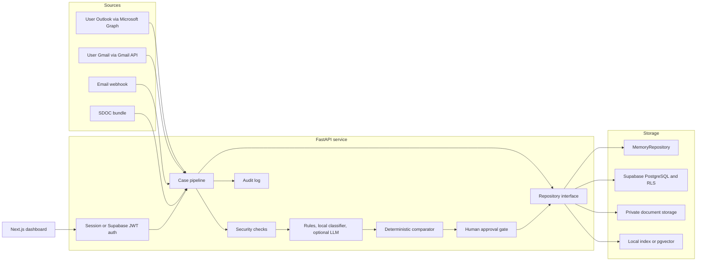
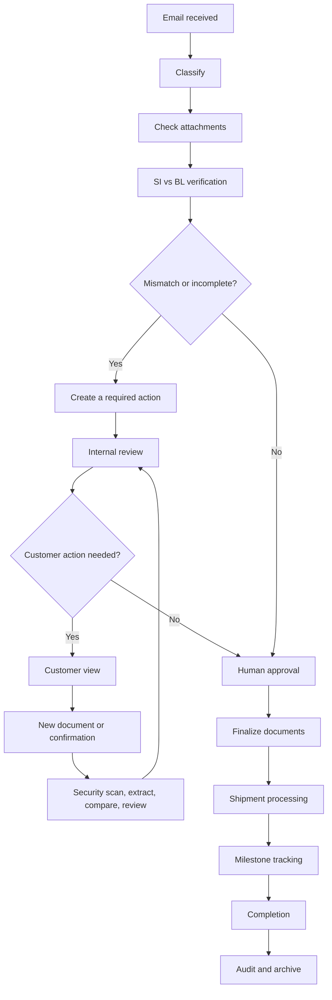

# NovaShip Averis

AI-assisted shipping inbox and deterministic Shipping Instruction (SI) to Draft Bill of Lading (BL) verification.

> AI reads, classifies, extracts, summarises, and drafts. Deterministic code decides the seven-field comparison. A person approves every outward action. Every state change is audited.

| Project status | Details |
| --- | --- |
| Web application | `http://localhost:3000` |
| API and Swagger UI | `http://localhost:8000/docs` |
| Default mode | Offline demo, in-memory repository, no API keys required |
| Demo data | 520 emails and 250 attachments |
| Demo performance | Inbox and other pages can feel slow: each navigation refetches from the in-memory 520-case dataset. See [§17](#pages-load-slowly-after-sign-in) |
| Test suite | **279** backend tests collected in `backend/tests/` (see [§15](#15-tests-evaluation-and-reproducibility)) |
| Recorded SDOC score | `1.0000`; reproducing the score requires the private organiser `ground_truth.json` |
| Demo password | `novaship123` for every seeded account |

## Table of contents

- [1. Overview](#1-overview)
- [2. What the platform does](#2-what-the-platform-does)
- [3. Verification contract](#3-verification-contract)
- [4. Architecture and data flow](#4-architecture-and-data-flow)
- [5. Technology stack](#5-technology-stack)
- [6. Quick start with Docker](#6-quick-start-with-docker)
- [7. Demo accounts and RBAC](#7-demo-accounts-and-rbac)
- [8. Development run modes](#8-development-run-modes)
- [9. Configuration reference](#9-configuration-reference)
- [10. Using the application](#10-using-the-application)
- [11. API reference](#11-api-reference)
- [12. Persistence and Supabase](#12-persistence-and-supabase)
- [13. AI, RAG, and LangGraph](#13-ai-rag-and-langgraph)
- [14. Security and safety model](#14-security-and-safety-model)
- [15. Tests, evaluation, and reproducibility](#15-tests-evaluation-and-reproducibility)
- [16. Deployment notes](#16-deployment-notes)
- [17. Troubleshooting](#17-troubleshooting)
- [18. Repository map](#18-repository-map)
- [19. Known limitations](#19-known-limitations)
- [20. End-to-end shipping workflow](#20-end-to-end-shipping-workflow)

## 1. Overview

Shipping documentation teams receive comparison requests, SI submissions, invoices, operational updates, automated notices, and spam in their mailboxes. A single BL comparison can require an operator to locate two documents, reconcile different labels and formats, verify seven contractual fields, explain every discrepancy, draft a response, and preserve an audit trail.

NovaShip turns that inbox into a case-management workflow. It can:

1. ingest an email and its attachments;
2. perform deterministic security checks;
3. classify the message and decide whether action is required;
4. detect SI and Draft BL documents;
5. extract the seven required fields with evidence;
6. normalise only safe formatting differences;
7. compare SI and BL values using deterministic code;
8. recommend an action and create a draft;
9. pause for a human decision;
10. share or simulate notification after permission and confirmation checks;
11. record the full decision trail.

The repository contains two related orchestration paths:

- `Pipeline` is the main ingestion and case-processing path used by the dashboard and REST API.
- `CaseAgent` is the LangGraph state machine exposed by `/agent/*`; it supports pause/resume at the human-review node.

Both paths use the same contracts, repository abstraction, comparator, policies, permissions, and case services.

### Demo dataset

The bundled SDOC dataset contains 520 synthetic but realistic emails:

| Category | Count |
| --- | ---: |
| BL comparison | 220 |
| SI request | 125 |
| Invoice query | 75 |
| General | 60 |
| Spam | 40 |

There are 250 attachment files. They include TXT, PDF, DOCX, and XLSX SI/BL pairs, plus deliberate missing, wrong, blank, unreadable, and image-only cases. The data generator is deterministic and lives under `sdoc-hackathon-docker/data_v2/`.

The inbox has 124 messages with two attachments, two with one attachment, and 394 with none. Of the attachment-bearing verification requests, 109 can be decided cleanly, 46 contain one or more planted field defects, and 20 edge cases are designed to require escalation rather than a guessed verdict.

## 2. What the platform does

### Inbox and case operations

- Converts each unique email into an idempotent case.
- Shows status, priority, intent, category, confidence, assignment, document availability, security outcome, mismatch count, agent-run state, and open errors.
- Defaults the Inbox work queue to cases the agent has **not run yet** (`agent=pending`). Finished runs live on **Processed** (`/history`).
- Supports search, pagination, sorting, and filters for status, priority, intent, category, mismatch, per-field mismatch, assignee, recipient, sender, confidence, security outcome, mailbox, agent run, attention (needs a person), and date. Presets include **Needs human**, **Needs me**, and **My mailbox**.
- Seven-field mismatch counts sit on the Inbox: click a field to list every case where that field differs (there is no separate `/verification` page).
- Provides batch drafting and review actions; batch operations never send external email.
- Exports cases as CSV or Excel, processed history as CSV/Excel, an overall desk report as Excel, and SDOC-compatible results as JSON.
- The shell notification bell polls `GET /me/notifications`: cases that need a person, new mail from the caller's connected mailbox (last 48 hours), and cases shared with the caller (last 7 days).

### Document verification

- Reads `.txt` `.md` `.csv` `.tsv` `.html` `.eml` `.rtf`, `.docx` `.xlsx`, legacy `.doc` `.xls`, text-layer `.pdf`, and — through OCR — scanned PDFs and `.png` `.jpg` `.webp` `.tiff` images. OCR-derived text is flagged on the attachment and its extraction confidence is capped at 0.9; the verdict still comes from the deterministic comparator.
- Detects SI, Draft BL, Invoice, Supporting Document, and Unknown Document.
- Extracts the required fields with the source document, page, line, literal snippet, and detected label.
- Preserves original values alongside normalised values.
- Routes missing, blank, unsupported, corrupt, scanned, or low-confidence data to review instead of guessing.
- Produces a field-by-field discrepancy report and an exact summary message.
- Treats SI vs Draft BL verification as the first major checkpoint. Incomplete data is meant to keep the case moving (request, upload, re-check) rather than stop the workflow. The intended continuation, including a separate customer view, is in [§20](#20-end-to-end-shipping-workflow).

### Human review and collaboration

- Generates confirmation, correction, missing-document, and information-response drafts.
- Allows a user to edit, approve, reject, reassign, retry, request review, mark no action, or complete a case. After `operator_guard.auto_draft_after` (default 3) of those mutations with no live draft, a draft is auto-saved and never sent. Unusual operator bursts, off-hours activity, denied external shares, and rapid archives raise a **warning dialog** without locking the account; burst limits are learned per user from the audit log (see §13).
- Separates the extracted Notify Party value from permission to contact a recipient.
- Requires an authorised recipient, a data preview, sufficient role permissions, and an extra confirmation for an external party.
- Records sent, viewed, acknowledged, response, and status metadata for a share.

### Oversight

- Provides Inbox seven-field mismatch filters, a Workbench run console (case autocomplete, parallel batch, multi-case agent runs with per-case review and graph inspect, self-evaluation against the hackathon reference), a security queue, Processed history, a global audit page, a versioned policy editor with optional learned suggestions, an overall Excel report, and an in-app guide.
- `/agent` redirects to `/workbench`. LangGraph pause/resume, graph state, and per-case traces live on Workbench and on the case **AI Agent** tab.
- Stores actor type (`USER`, `AI`, or `SYSTEM`), before/after state, evidence references, and policy version in audit events.
- Uses role-based access control (RBAC) for every protected API operation.
- Keeps policy changes versioned and audited. Admins can accept or dismiss security-gate suggestions; the desk never applies a suggestion by itself.

## 3. Verification contract

The Shipping Instruction is always the source of truth. The comparator evaluates exactly these seven independent fields:

| Field | Safe normalisation | Deliberately not done |
| --- | --- | --- |
| Shipper | Case and whitespace | Legal-name rewriting |
| Consignee | Case, whitespace, conservative punctuation | Inferring a different legal entity |
| Notify Party | Case, whitespace, conservative punctuation | Treating the extracted value as permission to send |
| Port of Loading | Case, whitespace, separators, trailing UN/LOCODE removal | Port substitution without evidence |
| Port of Discharge | Case, whitespace, separators, trailing UN/LOCODE removal | Port substitution without evidence |
| Container Count | Parses values such as `3 x 40'HC` as `3` | Guessing from unclear text |
| Gross Weight (kg) | Parses commas/spaces and explicit metric-ton conversion | Silent imperial conversion or mixed alphanumeric values |

Each field receives one result:

- `MATCH`
- `MISMATCH`
- `MISSING_IN_SI`
- `MISSING_IN_BL`
- `LOW_CONFIDENCE_REVIEW`

The case-level result is `PASSED`, `ATTENTION_REQUIRED`, or `HUMAN_REVIEW`. If all seven fields match, the required message is exactly:

```text
No mismatch detected.
```

A missing or low-confidence value is not counted as a mismatch. It is routed to human review with one of four review reasons: `wrong_doc_type`, `missing_attachment`, `unreadable`, or `missing_value`.

## 4. Architecture and data flow



### Main pipeline

Shipped today:

```text
Email
  -> security precheck
  -> intent classification
  -> attachment classification
  -> document extraction
  -> safe normalisation
  -> deterministic seven-field comparison
  -> policy evaluation and recommendation
  -> summary
  -> draft
  -> human approval
  -> notification/share
  -> audit
```

The security and intent stages can end the flow early. A security-review message is quarantined. Informational and spam messages are stored and summarised without document comparison. A verification request with missing documents becomes `WAITING_DOCUMENTS`; unreadable or uncertain content becomes `HUMAN_REVIEW`. Those incomplete states are not a stop: staff can upload a replacement and retry. The intended customer portal and post-verification shipment stages are in [§20](#20-end-to-end-shipping-workflow).

### Responsibility boundary

| Capability | Rules/local model | Optional LLM | Deterministic guard |
| --- | --- | --- | --- |
| Security precheck | Yes | Security explanation in the agent path | LLM can escalate, not clear a deterministic risk |
| Intent | Rules then TF-IDF/logistic regression | Final fallback for ambiguity | Confidence and override margins are recorded |
| Attachment type | Yes | No | Unreadable files are not guessed |
| Field extraction | Label and layout rules | Fallback for missing fields | LLM value must be supported by a literal document snippet |
| Comparison | Yes | **Never** | Pure seven-field comparator |
| Summary and draft | Templates | Wording polish | Required SI/BL values must remain present |
| Ask AI | Grounded intents and RAG | Free-form grounded answer | Refuses sending, bypassing policy, inventing values, or crossing case scope |
| Translation | Identifier masking | Translation | Names, ports, numbers, units, and references are restored |

## 5. Technology stack

| Layer | Technology |
| --- | --- |
| Frontend | Next.js 16.3, React 19.2, TypeScript 5.5, Tailwind CSS 3.4 |
| Backend | Python 3.11, FastAPI, Pydantic 2, Uvicorn |
| Local intent model | scikit-learn TF-IDF + logistic regression, persisted with joblib |
| Agent orchestration | LangGraph with memory or optional PostgreSQL checkpoints |
| LLM integration | OpenAI or Gemini chat through `LLM_PROVIDER=openai` or `LLM_PROVIDER=gemini`; default `none` |
| Embeddings | Local deterministic hashing, Gemini, or OpenAI |
| Vector storage | Local JSON index or Supabase pgvector |
| Document parsing | pypdf, python-docx, openpyxl, xlrd, olefile, standard-library csv/html/eml/rtf readers; Gemini vision OCR for scans and images (on when `GOOGLE_API_KEY` is set), pytesseract fallback |
| Persistence | In-memory fixtures or Supabase PostgreSQL, Storage, RLS, and JWT |
| Mail | Each user's own Outlook (Microsoft Graph) or Gmail (Gmail API) for inbound polling and approved outbound delivery; SDOC bundle connector for fixtures; optional shared Gmail desk mailbox |
| Containers | Docker multi-stage images and Docker Compose |
| Tests | pytest plus a production Next.js build |

## 6. Quick start with Docker

Docker is the recommended first run. It uses the checked-in demo snapshot and does not require Supabase, OpenAI, Gemini, Microsoft, or Google credentials.

### Prerequisites

- Docker Desktop, or Docker Engine with the Compose plugin.
- Git.
- Ports `3000` and `8000` available, unless you override them.

### Start the application

From the repository root:

```bash
cp .env.example .env
docker compose up -d --build
docker compose ps
curl http://localhost:8000/health
```

PowerShell:

```powershell
Copy-Item .env.example .env
docker compose up -d --build
docker compose ps
Invoke-RestMethod http://localhost:8000/health
```

A healthy default response includes `"status": "ok"`, `"backend": "MemoryRepository"`, and `"cases": 520`.

Open:

- Application: `http://localhost:3000`
- Login: `http://localhost:3000/login`
- Swagger UI: `http://localhost:8000/docs`
- API health: `http://localhost:8000/health`

Sign in with `faraz_ali@aprilasia.com` and password `novaship123`, or use any account in [Demo accounts and RBAC](#7-demo-accounts-and-rbac).

### Stop the application

```bash
docker compose down
```

This stops the containers. It does not delete the source tree, built images, or external Supabase data. Do not add `-v` unless you explicitly intend to remove Compose volumes.

## 7. Demo accounts and RBAC

Every seeded account uses `DEMO_PASSWORD`, which defaults to `novaship123`.

| Role | Name | Email | Main access |
| --- | --- | --- | --- |
| Admin + Supervisor | Syed Faraz Ali | `faraz_ali@aprilasia.com` | All operations, policy editing, external approval, audit, export |
| Supervisor | Hari Mardianto | `hari_mardianto@aprilasia.com` | Approval, external notification, batch actions, audit, export |
| Supervisor | Teo Ei Leen | `eileen_teo@aprilasia.com` | Same supervisor access |
| Operations | Najiha Nur Hanna | `hanna_azhari@aprilasia.com` | Case work, comparison, drafts, assignment, internal sharing |
| Operations | Deswita Elvyani | `deswita_elvyani@aprilasia.com` | Same operations access |
| Operations | Willy Situmorang | `willy_ss@aprilasia.com` | Same operations access |
| Operations | Mitchelle Ting | `mitchelle_ting@aprilasia.com` | Same operations access |
| Auditor | Ooi Sok Yong | `sokyong_ooi@aprilasia.com` | Read-only cases, global audit, and export |

### Permission matrix

| Permission | Operations | Supervisor | Admin | Auditor |
| --- | :---: | :---: | :---: | :---: |
| View cases and documents | Yes | Yes | Yes | Yes |
| Compare and edit extraction | Yes | Yes | Yes | No |
| Generate/edit drafts | Yes | Yes | Yes | No |
| Approve an external draft | No | Yes | Yes | No |
| Share internally | Yes | Yes | Yes | No |
| Notify an external party | No | Yes | Yes | No |
| Assign a case | Yes | Yes | Yes | No |
| View policy | Yes | Yes | Yes | No |
| Edit policy | No | No | Yes | No |
| View global audit | No | Yes | Yes | Yes |
| Export data | No | Yes | Yes | Yes |
| Batch actions | No | Yes | Yes | No |
| Ingest email | Yes | Yes | Yes | No |

Self-registration at `/register` creates an account on the **shared desk** (seeded cases stay visible). Default `REGISTER_ALLOWED_ROLES=OPERATIONS_STAFF`. The hackathon demo can set `ADMIN,SUPERVISOR,OPERATIONS_STAFF` so a visitor can register with their own email as Admin and manage the current project. Registration is enabled in `demo` mode, disabled by default in `local` mode, and unavailable in `jwt` mode. The API accepts only roles listed in `REGISTER_ALLOWED_ROLES`.

### Sign in with Microsoft / Google and connected mailboxes

Each user works their **own** mailbox: the desk reads it and approved replies leave from it. No shared desk mailbox is needed (`EMAIL_PROVIDER=none`); when none is configured, Fetch shows *Connect a mailbox*. An approved reply leaves from the mailbox the mail **arrived in** when that one can still send, otherwise from the **approver's own** connected Outlook/Gmail (so seeded, uploaded and webhook cases are answerable too), otherwise from the shared mailbox; the Draft Actions tab says which one (*Replies leave from …*) before you press Approve. When none can send, Approve is disabled with the exact reason (no mailbox connected / needs reconnecting / no send permission) and the API answers a clear, retryable `502` instead of sending from somewhere else.

**Continue with Microsoft** (`/login`, `/register`) asks for identity only (`openid profile email User.Read`) and creates or opens the desk account for that address. **Connect Outlook** (Guide page or the Inbox banner) is a second consent for `Mail.Read Mail.Send offline_access`; the refresh token is stored encrypted and Microsoft's rotated tokens are persisted on every refresh. Graph delegated mail permissions need no publisher review, so users see at most a small "unverified" tag (removed by Publisher Verification).

Entra setup in short: App registration → Web platform redirect `MICROSOFT_REDIRECT_URI` (`http://localhost:8000/auth/microsoft/callback` locally, `https://<domain>/api/auth/microsoft/callback` on Vercel) → put Application ID and client-secret *value* in `MICROSOFT_CLIENT_ID` / `MICROSOFT_CLIENT_SECRET`; `MICROSOFT_TENANT=common` unless you restrict to one organisation.

**Continue with Google** does account + Gmail in one consent (`openid email profile gmail.readonly gmail.send`):

1. creates the desk account for that Google address (role from the register form, validated against `REGISTER_ALLOWED_ROLES`) or logs in the existing account with that email;
2. stores the Gmail refresh token **encrypted** (`user_mailboxes`, Fernet with `MAILBOX_TOKEN_KEY` or a key derived from `SESSION_SECRET`);
3. returns a normal `nsa.*` session, so RBAC, audit, and every other route are unchanged.

A signed-in password user can also connect a mailbox later (Guide page → *Connect Outlook* / *Connect Gmail*); the grant links to the current account instead of creating one. Which buttons appear comes from `GET /auth/config` (`microsoft_enabled`, `google_enabled`, `shared_mailbox_configured`).

Once a mailbox is connected:

- **Fetch Inbox** (and `POST /connectors/poll?source=auto`) polls that user's Outlook or Gmail instead of the shared `GMAIL_ADDRESS`; `source=shared` still polls the desk mailbox when one is configured, otherwise `400 NO_SHARED_MAILBOX` / `NO_MAILBOX_CONNECTED`.
- Every case pulled this way lands on the **shared desk** tagged with `mailbox` / `mailbox_user_id`; the Inbox shows the tag and offers a *My mailbox* preset (`GET /cases?mailbox=me`).
- With `GMAIL_POLL_INTERVAL_SECONDS>0` a background thread polls every connected mailbox and the shared one on that interval (actor `scheduler`).
- When a draft or external share on such a case is approved and `EMAIL_SEND_MODE=live` (alias `gmail`), the reply is sent **from the owner's mailbox** (the one the request arrived in: Gmail API or Microsoft Graph `sendMail`). Without send permission on that grant it falls back to the shared mailbox; the audit event records `from`.
- Every approved draft records a **delivery block** (mode, provider, from-address, provider id, time) and **Verify delivery** (`POST /cases/{id}/drafts/{draft_id}/verify-delivery`) asks the sending mailbox whether the message is in its Sent Items or whether an undeliverable notice came back (audited as `DELIVERY_VERIFIED` / `DELIVERY_BOUNCED` / `DELIVERY_UNVERIFIED`). In `EMAIL_SEND_MODE=simulate` the button reads *Approve (simulated)* and the card says no e-mail was sent; `/health.email.send_mode` exposes the mode.
- `GET /me/mailbox` shows the connection and provider; `DELETE /me/mailbox` disconnects it (best-effort revoke at Google; Microsoft grants are removed at myaccount.microsoft.com/consent), audited.

Google Cloud prerequisites: an OAuth client of type **Web application** whose authorized redirect URI is `GOOGLE_OAUTH_REDIRECT_URI` (`http://localhost:8000/auth/google/callback` locally, `https://<domain>/api/auth/google/callback` on Vercel); the Gmail API enabled; and, while the consent screen is in *Testing*, each Google account added as a test user. Password-only accounts keep working; Google-only accounts have no password and sign in with Google.

Sessions are HMAC-signed and expire after 12 hours by default. Logout revokes the session server-side. Login, failed login, registration, and logout outcomes are audited.

## 8. Development run modes

Docker and host processes cannot bind the same port at the same time. Stop the active mode before switching.

### Docker live reload

```bash
docker compose -f docker-compose.yml -f docker-compose.dev.yml up -d --build
```

The development overlay bind-mounts `backend/app`, `backend/scripts`, `backend/models`, and the full `frontend` directory. Uvicorn and Next.js reload when host files change.

### Windows helper

The PowerShell helper manages containers and local Node/Python listeners:

```powershell
.\scripts\dev.ps1 docker
.\scripts\dev.ps1 docker-dev
.\scripts\dev.ps1 local
.\scripts\dev.ps1 frontend
.\scripts\dev.ps1 backend
.\scripts\dev.ps1 status
.\scripts\dev.ps1 stop
```

If execution is blocked:

```powershell
powershell -ExecutionPolicy Bypass -File .\scripts\dev.ps1 docker
```

`scripts/dev.sh` currently uses `netstat -ano`, `tasklist`, and `taskkill`; it is intended for Git Bash or similar Windows environments. On macOS and Linux, use the direct Docker and local commands in this README.

### Local backend and frontend

Prerequisites:

- Python 3.11+
- Node.js 20+
- npm

Terminal 1:

```bash
python3.11 -m venv ../novaship-venv
source ../novaship-venv/bin/activate
python -m pip install -r backend/requirements.txt
cd backend
python -m uvicorn app.main:app --reload --port 8000
```

Terminal 2:

```bash
cd frontend
npm ci
npm run dev
```

The backend loads the repository-root `.env` even when Uvicorn starts inside `backend/`. Relative bundle and seed paths are resolved against the repository root.

### Mixed modes

Local UI with Docker API:

```bash
docker compose stop web
docker compose up -d api
cd frontend
npm ci
npm run dev
```

Local API with Docker UI:

```bash
docker compose stop api
cd backend
python -m uvicorn app.main:app --reload --port 8000
```

Keep the unused Compose service stopped. The browser uses `NEXT_PUBLIC_API_BASE`, which defaults to `http://localhost:8000`.

## 9. Configuration reference

Copy `.env.example` to `.env`. Never commit `.env`. Variables with public frontend visibility must be safe for a browser; never put an API key or Supabase service-role key in `NEXT_PUBLIC_*`.

### Core and persistence

| Variable | Default | Description |
| --- | --- | --- |
| `REPO_BACKEND` | `memory` | `memory` or `supabase` |
| `TENANT_ID` | `tenant_april` | Tenant used for repository and vector scoping |
| `BUNDLE_DIR` | `./sdoc-hackathon-bundle` | Email fixture root |
| `SEED_SNAPSHOT` | `./supabase/seed/snapshot.json` | Snapshot loaded by `MemoryRepository` |
| `AUTO_SEED` | `1` | Load the snapshot at API startup |
| `SUPABASE_URL` | placeholder | Supabase project URL |
| `SUPABASE_SECRET_KEY` | empty | Preferred modern `sb_secret_*` server credential |
| `SUPABASE_SERVICE_ROLE_KEY` | placeholder | Supported legacy server-only credential used when the modern secret is absent |
| `SUPABASE_JWT_ALGORITHM` | `JWKS` | JWT verification mode; use `HS256` only for an explicitly configured legacy shared secret |
| `SUPABASE_JWT_SECRET` | placeholder | Legacy HS256 secret; not used by the default JWKS mode |
| `SUPABASE_STORAGE_BUCKET` | `documents` | Private attachment bucket |

### Authentication

| Variable | Default | Description |
| --- | --- | --- |
| `AUTH_MODE` | `demo` | `demo` accepts local sessions and `X-User-Id`; `local` accepts hardened local sessions; `jwt` accepts Supabase JWTs only |
| `SESSION_SECRET` | insecure development fallback | HMAC secret for built-in session tokens; mandatory to replace in production |
| `SESSION_TTL_HOURS` | `12` | Session lifetime |
| `DEMO_PASSWORD` | `novaship123` | Password assigned to seeded users without a credential |
| `REGISTER_ALLOWED_ROLES` | `OPERATIONS_STAFF` | Roles the register form and API accept. Least privilege by default. Hackathon demo: `ADMIN,SUPERVISOR,OPERATIONS_STAFF` (Admin first) |
| `SELF_REGISTRATION_ENABLED` | `0` | Enables registration in `local` mode; demo mode keeps hackathon registration enabled |

### Classification and LLM

| Variable | Default | Description |
| --- | --- | --- |
| `INTENT_MODEL_ENABLED` | `1` | Enable the local trained intent classifier |
| `INTENT_MODEL_PATH` | auto-detected `backend/models/intent_classifier.joblib` | Classifier artifact path |
| `LLM_PROVIDER` | `none` | `none`, `openai`, or `gemini` |
| `OPENAI_API_KEY` | empty | Used only when OpenAI chat or embeddings are enabled |
| `LLM_MODEL` | `gpt-4o-mini` in code when unset | Optional chat-model override; `.env.example` suggests `gpt-4.1-mini` for OpenAI |
| `GEMINI_CHAT_MODEL` | `gemini-3.6-flash` | Chat model when `LLM_PROVIDER=gemini` |
| `GEMINI_OCR_MODEL` | same as chat model | Vision model for optional image-only PDF OCR |

If the model artifact or API call fails, the application falls back to deterministic rules. The comparator never falls back to an LLM.

### RAG and agent checkpoints

| Variable | Default | Description |
| --- | --- | --- |
| `EMBEDDING_PROVIDER` | `local` | `local`, `gemini`, or `openai` |
| `GOOGLE_API_KEY` | empty | Gemini embedding, chat, and optional vision OCR key |
| `GEMINI_EMBEDDING_MODEL` | `models/text-embedding-004` | Gemini embedding model |
| `OPENAI_EMBEDDING_MODEL` | `text-embedding-3-small` | OpenAI embedding model |
| `EMBEDDING_DIMENSIONS` | `768` in `.env.example` | Output dimension; must match the selected provider and vector schema |
| `VECTOR_STORE` | `local` | `local` JSON index or `supabase` pgvector |
| `SUPABASE_VECTOR_DIMENSIONS` | `768` | Expected live pgvector column dimension; startup rejects mismatches |
| `RAG_DATA_DIR` | `backend/data` | Markdown knowledge and local index directory |
| `LANGGRAPH_CHECKPOINT` | `memory` | `memory` or `postgres` |
| `LANGGRAPH_PG_URL` | empty | PostgreSQL connection string for durable agent checkpoints |
| `LANGGRAPH_STRICT_MSGPACK` | `true` in `.env.example` | Restricts persisted checkpoint deserialisation to known-safe types |

The local, Gemini, and OpenAI embeddings use different dimensions. Rebuild the index after changing provider or model. The pgvector migration defaults to 768 dimensions and must be adjusted before using a provider with another dimension.

The PostgreSQL LangGraph checkpointer dependencies are included in `backend/requirements.txt`. For replaceable serverless instances, use a durable PostgreSQL checkpoint store rather than process memory.

### Email, OCR, and networking

| Variable | Default | Description |
| --- | --- | --- |
| `EMAIL_PROVIDER` | `none` | `none`, `bundle`, or `gmail` for inbound polling |
| `EMAIL_SEND_MODE` | `simulate` | `simulate` or `gmail`; real delivery still requires the normal human approval path. In `gmail` mode a case fetched from a user's connected mailbox replies from that mailbox |
| `GOOGLE_OAUTH_CLIENT_ID` | falls back to `GMAIL_CLIENT_ID` | Web-application OAuth client for Sign in with Google |
| `GOOGLE_OAUTH_CLIENT_SECRET` | falls back to `GMAIL_CLIENT_SECRET` | Secret for that client (server-only) |
| `GOOGLE_OAUTH_REDIRECT_URI` | `http://localhost:8000/auth/google/callback` | Must be listed as an authorized redirect URI on the client |
| `MICROSOFT_CLIENT_ID` | — | Entra app registration (Application ID) for Sign in with Microsoft + Connect Outlook |
| `MICROSOFT_CLIENT_SECRET` | — | Client secret *value* (server-only) |
| `MICROSOFT_TENANT` | `common` | `common` (work/school + personal) or a tenant id to restrict sign-in to one organisation |
| `MICROSOFT_REDIRECT_URI` | `http://localhost:8000/auth/microsoft/callback` | Must be a Web platform redirect URI on the registration |
| `FRONTEND_URL` | first `CORS_ORIGINS` entry | Where the callback sends the browser (`/auth/callback`) |
| `MAILBOX_TOKEN_KEY` | derived from `SESSION_SECRET` | Fernet key that encrypts stored Gmail/Outlook refresh tokens; rotating it forces users to reconnect |
| `GMAIL_POLL_INTERVAL_SECONDS` | `0` | `>0` starts the background poller for every connected mailbox (Gmail and Outlook) plus the shared one when configured |
| `EMAIL_PROVIDER` | `none` | `none` = individual mailboxes only (recommended); `gmail` = also poll the shared `GMAIL_*` mailbox; `bundle` = local fixtures |
| `EMAIL_SEND_MODE` | `simulate` | `simulate` records approved sends without calling a provider; `live` (alias `gmail`) sends from the case's own mailbox, or the shared one |
| `GMAIL_CLIENT_ID` | empty | *Optional shared mailbox only.* Google OAuth client ID |
| `GMAIL_CLIENT_SECRET` | empty | *Optional shared mailbox only.* Google OAuth client secret |
| `GMAIL_REFRESH_TOKEN` | empty | *Optional shared mailbox only.* Refresh token created by the local authorisation helper |
| `GMAIL_ADDRESS` | empty | *Optional shared mailbox only.* Monitored and sending desk address |
| `OCR_ENABLED` | `auto` | `auto` = on when `GOOGLE_API_KEY` is set; `1` forces on, `0` off. Gemini vision then pytesseract for scanned PDFs and image attachments; policy `ai_privacy.allow_vision_ocr` can veto it |
| `LLM_PRIVACY` | `mask` | `mask` replaces company names, references, addresses and document values with `__IDn__` tokens before any OpenAI/Gemini prompt; `off` sends plain text |
| `EVAL_GROUND_TRUTH` | `sdoc-hackathon-docker/data_v2/ground_truth.json` | Private organiser reference for Workbench / `GET /evaluate`. Gitignored; Compose mounts it when present. Absent → 404 unless the Workbench card uploads a file |
| `EVAL_SCORING` | `sdoc-hackathon-docker/server/scoring.py` | Organiser `scoring.py` used by self-evaluation (no pipeline replay) |
| `BATCH_PARALLELISM` | `4` | Default worker count for `/cases/batch` and `/agent/run-batch` (1–16) |
| `MAX_UPLOAD_BYTES` | `10485760` | Maximum bytes accepted for one attachment |
| `MAX_ATTACHMENT_COUNT` | `10` | Maximum attachments accepted in one inbound message |
| `CORS_ORIGINS` | local UI origins | Comma-separated API origins |
| `APP_ENV` | `development` | Requires an explicit non-wildcard CORS allowlist outside development, test, and demo |
| `API_PREFIX` | empty locally; `/api` on Vercel | Optional prefix applied to the API, docs, and OpenAPI routes |
| `LOG_LEVEL` | `INFO` | Backend log level |
| `PORT` | `8000` | API container listen port used by the Docker image command |
| `NEXT_PUBLIC_API_BASE` | `http://localhost:8000` | API base embedded in the frontend production build |
| `WEB_PORT` | `3000` | Host port used by Compose for the frontend |
| `API_PORT` | `8000` | Host port used by Compose for the API |

Gemini vision OCR needs only `GOOGLE_API_KEY`; the pytesseract fallback additionally needs `pytesseract`, `pdf2image`, Tesseract, and Poppler, which the default image does not install. OCR never decides MATCH/MISMATCH; scans that stay unreadable still escalate to review. `scripts/run_bundle.py` keeps OCR off unless `--ocr` is passed so scoring stays deterministic.

Only if you run an optional **shared** desk mailbox (`EMAIL_PROVIDER=gmail`): after setting the `GMAIL_*` client ID and secret in a local `.env`, create or rotate its refresh token without printing it with `python backend/scripts/gmail_authorize.py`. Individual Outlook/Gmail connections need none of that; they use the consents in §7.

## 10. Using the application

### Pages

| Route | Purpose |
| --- | --- |
| `/` | Inbox: metrics, seven-field mismatch strip, work queue (default: agent not yet run), filters, Fetch inbox, batch |
| `/cases/{id}` | Email, documents, comparison, evidence, drafts, actions, collaboration, Ask AI, agent tab, errors, and timeline |
| `/security` | Security-review, suspicious, spam, and anomaly queue |
| `/workbench` | Operator run console: LangGraph inspect, parallel agent/batch (never sends email), CSV/Excel export, RAG/privacy posture, self-evaluation |
| `/history` | Processed: cases the AI agent has run or a person marked complete; Excel/CSV export. Distinct from Audit (event log) |
| `/agent` | Redirects to `/workbench` so old bookmarks and Guide links still work |
| `/audit` | Global audit log for Supervisor, Admin, and Auditor |
| `/policies` | Effective policy for permitted roles; editing and learned suggestions for Admin only |
| `/welcome` | Product guide and Connect Outlook / Connect Gmail |
| `/login` | Sign in and demo account picker |
| `/register` | Self-registration onto the shared desk (password, Microsoft, or Google); roles come from `REGISTER_ALLOWED_ROLES` |
| `/auth/callback` | Landing page after Microsoft/Google consent; stores the session from the URL fragment and continues |

There is no `/verification` route. Per-field mismatch counts are on the Inbox; click a field to filter the table. There is no customer portal yet. The first open of Security, Audit, Workbench, Processed, or a case can be slow on the 520-case demo; see [§17](#pages-load-slowly-after-sign-in).

### Recommended operator workflow

1. Sign in and open the Inbox. The queue defaults to cases the agent has not run yet.
2. Use **Needs human**, **Mismatch**, a seven-field strip click, or **My mailbox** to narrow the list.
3. Open a case and review the source email and document status.
4. Inspect all seven field results and the literal evidence snippets.
5. If a document is missing or unreadable, upload a replacement and retry.
6. Review or edit the generated draft.
7. Approve, reject, assign, request review, or mark the case complete.
8. For Notify Party, select an authorised recipient and inspect the disclosure preview.
9. Confirm an external share if your role permits it.
10. Use the case timeline, Audit, or **Processed** (`/history`) to verify the recorded action.
11. For multi-case runs, open Workbench (`/workbench`): pick cases with the autocomplete, run the agent on all of them in parallel, review each paused case from the results table, batch classify/compare/draft/review with per-case errors and *Retry failed*, and export CSV, Excel or the overall report. Batch never sends external email. Supervisors/Admins can run **Self-evaluation** there against the organiser reference.

To prove a **connected mailbox** without the fixture bundle: send yourself an SI + Draft BL pair, Fetch inbox, open the case, confirm seven fields and a draft that is not sent. Repeat with a missing attachment (`WAITING_DOCUMENTS`) and a phishing-style subject (Security queue) if you want those gates.

`AUTH_MODE=demo` is the hackathon default (signed sessions plus `X-User-Id`). `local` is the same sessions without the header shortcut. `jwt` is Supabase tokens only. Keep `EMAIL_SEND_MODE=simulate` until approval, recipient, and recovery checks are proven; then set `live`.

### Case states

The API contract defines 18 states:

```text
RECEIVED
SECURITY_CHECK
SECURITY_REVIEW
CLASSIFIED
NO_ACTION_INFO
DOCUMENTS_DETECTED
WAITING_DOCUMENTS
EXTRACTING
COMPARING
NO_MISMATCH_DETECTED
MISMATCH_DETECTED
HUMAN_REVIEW
DRAFT_READY
NOTIFY_PARTY
AWAITING_RESPONSE
ASSIGNED
COMPLETED
ERROR
```

Not every case visits every state. The pipeline may finish early for spam, information-only mail, security review, missing documents, or extraction uncertainty. `WAITING_DOCUMENTS`, `HUMAN_REVIEW`, and `AWAITING_RESPONSE` are the current incomplete-data holding states. The intended customer portal would sit on those states instead of ending the shipment there. See [§20](#20-end-to-end-shipping-workflow).

## 11. API reference

Swagger UI at `/docs` is the source of truth for request and response schemas. The service currently exposes **79** routes.

### Authentication

Use one of these mechanisms:

1. Built-in session token: `Authorization: Bearer nsa.<token>`.
2. Supabase JWT: `Authorization: Bearer <jwt>` with `SUPABASE_JWT_SECRET` configured.
3. Demo-only header: `X-User-Id: u_admin_1` when `AUTH_MODE=demo`.

Unauthenticated routes are `/health`, `/auth/config`, `/auth/login`, `/auth/register`, and `/contracts/fields`. Other routes require a valid identity and, where applicable, a permission.

Login example:

```bash
curl -X POST http://localhost:8000/auth/login \
  -H 'Content-Type: application/json' \
  -d '{"email":"faraz_ali@aprilasia.com","password":"novaship123"}'
```

For quick demo calls:

```bash
curl 'http://localhost:8000/cases?mismatch=yes&limit=5' \
  -H 'X-User-Id: u_admin_1'
```

### Route catalogue

#### Health, identity, and contracts

| Method | Path | Purpose |
| --- | --- | --- |
| GET | `/health` | Repository type, case/email counts, LLM posture, mailbox-migration flag, timestamp |
| GET | `/me` | Current user and permissions |
| GET | `/me/notifications` | Needs-person queue, new mail from the caller's mailbox (48 h), and shares to the caller (7 d) |
| GET | `/users` | Users, teams, and approved parties |
| GET | `/contracts/fields` | Seven field names and exact no-mismatch message |

#### Authentication

| Method | Path | Purpose |
| --- | --- | --- |
| GET | `/auth/config` | Auth mode, registration roles, and demo account metadata |
| POST | `/auth/login` | Issue a session token |
| POST | `/auth/register` | Create an account (role from `REGISTER_ALLOWED_ROLES`) and session |
| POST | `/auth/logout` | Revoke the current session |
| GET | `/auth/session` | Validate the current session and return permissions and the connected mailbox |
| GET | `/auth/google/start?role=&next=` | Build the Google consent URL; with a session it connects Gmail to that account |
| GET | `/auth/google/callback` | Google redirect target; creates/logs in the user, stores the encrypted refresh token, redirects to the UI |
| GET | `/auth/microsoft/start?intent=login\|connect&role=&next=` | Microsoft consent URL: `login` = identity only; `connect` (needs a session) = Mail.Read + Mail.Send for the current account |
| GET | `/auth/microsoft/callback` | Microsoft redirect target; creates/logs in the user, or stores the encrypted Outlook refresh token, then redirects to the UI |
| GET | `/me/mailbox` | The caller's connected mailbox (provider, address, scopes, status, last poll) + which providers this deployment offers |
| DELETE | `/me/mailbox` | Disconnect the caller's mailbox (revoke at Google best-effort, audited) |

#### Ingestion and connectors

| Method | Path | Purpose |
| --- | --- | --- |
| POST | `/webhooks/email` | Ingest an email with base64 attachments or fixture paths |
| POST | `/connectors/poll?limit=25&source=auto` | Poll a mailbox: `mine` (caller's connected Outlook/Gmail), `shared` (bundle/Gmail from `.env`, if configured), `auto` (mine when connected, else shared; `400 NO_MAILBOX_CONNECTED` when neither exists) |
| POST | `/ingest/bundle?limit=0` | Import the local SDOC fixture bundle |

The webhook is idempotent on message content. A duplicate returns the existing case instead of creating another one.

#### Dashboard and cases

| Method | Path | Purpose |
| --- | --- | --- |
| GET | `/dashboard/metrics` | Operational metrics grouped by status, intent, and priority |
| GET | `/dashboard/bootstrap` | One payload for the Inbox widgets (metrics, fields, attention, security counts, recent audit, users) |
| GET | `/dashboard/fields` | Aggregate results for each verification field |
| GET | `/dashboard/field/{field}` | Cases for one field and optional result filter |
| GET | `/cases` | Search, filter, sort, and paginate cases |
| GET | `/cases/suggest?q=&limit=10` | Autocomplete for case pickers (id prefix, then id, subject, sender) |
| GET | `/cases/{case_id}` | Complete case view with source email |
| GET | `/cases/{case_id}/comparison` | Seven-field comparison |
| GET | `/cases/{case_id}/report` | Compact and structured discrepancy report |
| GET | `/cases/{case_id}/audit` | Case audit events and shares |
| GET | `/cases/{case_id}/documents/{attachment_id}` | Attachment metadata and optional signed URL |
| GET | `/cases/{case_id}/documents/{attachment_id}/raw` | Raw attachment bytes with `nosniff` |

`GET /cases` supports `status`, `priority`, `intent`, `category`, `mismatch=yes|no`, `field` (one of the seven fields: keep cases whose comparison of that field is not MATCH), `assigned`, `shared`, `sender`, `q`, `min_confidence`, `security`, `date_from`, `date_to`, `attention=yes`, `mailbox=<user_id>|me|shared`, `agent=pending|paused|done|any`, `limit`, `offset`, and `sort`. The Inbox defaults to `agent=pending`.

#### Pipeline and recovery

| Method | Path | Purpose |
| --- | --- | --- |
| POST | `/cases/{case_id}/classify` | Force case reprocessing from classification |
| POST | `/cases/{case_id}/extract` | Force reprocessing for extraction |
| POST | `/cases/{case_id}/compare` | Force reprocessing for comparison |
| POST | `/cases/{case_id}/retry` | Retry the case pipeline |
| POST | `/cases/{case_id}/upload` | Upload/re-link a missing SI or BL, then rerun |

The current service re-runs the complete pipeline for the classify/extract/compare/retry endpoints; the step name is recorded in the audit event.

#### Human decisions and collaboration

| Method | Path | Purpose |
| --- | --- | --- |
| POST | `/cases/{case_id}/draft` | Generate another draft, optionally translated |
| POST | `/cases/{case_id}/draft/edit` | Edit and version a draft |
| POST | `/cases/{case_id}/approve` | Approve a draft, then simulate or deliver it through Gmail according to `EMAIL_SEND_MODE` |
| POST | `/cases/{case_id}/reject` | Reject a draft and return the case to review |
| POST | `/cases/{case_id}/assign` | Assign a user or team |
| POST | `/cases/{case_id}/no-action` | Mark the case as no action required |
| POST | `/cases/{case_id}/complete` | Complete the case |
| POST | `/cases/{case_id}/request-review` | Send the case to human review |
| POST | `/cases/{case_id}/notify-party` | Begin the Notify Party flow |
| GET | `/cases/{case_id}/recipients` | List recipient choices and whether they are allowed |
| POST | `/cases/{case_id}/share` | Preview or create an internal/external share |
| POST | `/cases/{case_id}/share/{share_id}/confirm` | Confirm a pending external share |
| POST | `/shares/{share_id}/acknowledge` | Record view, acknowledgement, and response |
| POST | `/cases/batch` | Confirmed batch operations run in parallel (`params.parallel`, default `BATCH_PARALLELISM`) with a per-case `ok/error/ms` row, `failed_ids`, and `params.retry_failed=[ids]`; `export` returns CSV, `export_xlsx` / `report_xlsx` a base64 `.xlsx` blob. Never sends email. |

#### Ask AI, translation, export, history, evaluation, and policy

| Method | Path | Purpose |
| --- | --- | --- |
| POST | `/cases/{case_id}/ask` | Grounded question about one case |
| POST | `/cases/{case_id}/translate` | Translate supplied text or the source email |
| GET | `/export/cases.csv` | Export cases as CSV |
| GET | `/export/cases.xlsx` | Export cases as Excel (Cases, Field results, Summary sheets) |
| GET | `/export/report.xlsx` | Overall desk report: Overview, Seven fields, Cases, Field results, Security, Drafts & delivery, Operator activity, Mailboxes, Errors |
| GET | `/history` | Processed cases (agent run or marked complete); `result=done\|paused\|error\|all`, `run_by=me`, `q`, dates |
| GET | `/export/history.xlsx` | Same list as Excel (`export_data`) |
| GET | `/export/history.csv` | Same list as CSV (`export_data`) |
| GET | `/me/operator-profile` | What the operator guard has learned for the caller (pace, hours, effective limits) |
| GET | `/export/submission.json` | Export SDOC submission JSON for every case the desk holds |
| GET | `/evaluate` | Score current desk results against the organiser reference (no pipeline replay; `export_data`) |
| POST | `/evaluate` | Same scoreboard against an uploaded `ground_truth.json` (scored in memory, never stored) |
| GET | `/evaluate/report.md` | Markdown report of the last local-file evaluation |
| GET | `/evaluate/submission.json` | Bundle-id submission (missing ids filled with the placeholder) |
| GET | `/policies` | Active, effective, explained, and versioned policy |
| PUT | `/policies` | Update policy with an audit note; Admin only. Optional `accepted_suggestions` |
| GET | `/policies/suggestions` | Learned security-gate proposals; nothing is applied until an Admin saves |
| POST | `/policies/suggestions/{id}/dismiss` | Dismiss a suggestion (Admin; audited) |

#### LangGraph, RAG, security, and global audit

| Method | Path | Purpose |
| --- | --- | --- |
| GET | `/agent/graph` | Mermaid graph and node list |
| POST | `/agent/run/{case_id}` | Run the agent until completion or interrupt |
| GET | `/agent/state/{case_id}` | Read checkpoint and interrupt state |
| POST | `/agent/resume/{case_id}` | Resume with a human decision |
| POST | `/agent/run-batch` | Run the agent on many cases in parallel; per-case ok / paused / error, `paused_ids`, `failed_ids` |
| POST | `/agent/resume-batch` | Resume paused graphs in bulk with a non-sending decision (`retry`, `request_review`, `reject`, `mark_no_action`, `complete`, `reassign`); `approve`/`notify_party` stay per case |
| GET | `/rag/info` | Embedding provider, dimensions, store, and chunk count |
| POST | `/rag/search` | Search knowledge and optional case-scoped chunks |
| POST | `/rag/reindex` | Rebuild knowledge and case vectors; Admin only |
| GET | `/security/queue` | Security and anomaly cases |
| GET | `/audit` | Filtered global audit log |

### Self-evaluation against the hackathon reference

The brief ships a self-evaluation (one JSON keyed by `email_id`, shape of `sample_submission.json`). NovaShip scores the results it **already holds** — no pipeline replay.

- **Workbench → Self-evaluation** → *Evaluate current results*: final score, classification accuracy / macro-F1, mismatch precision / recall / field-F1, end-to-end, escalation recall / precision, per-category table, and every disagreement with the reference as a link to the case. *Download report (MD)* / *Download submission.json*. On a host without `ground_truth.json` (typical Vercel), choose the judges' file in the card; `POST /evaluate` scores it in memory and never stores it.
- CLI: `python backend/scripts/evaluate.py` (reads `GET /export/submission.json` from the running API, scores with the organiser's `scoring.py` against `ground_truth.json`, writes `evaluation/report.md`, `scoreboard.json`, `submission.json`). `--file submission.json` scores a file, `--server http://localhost:8081` also POSTs to the organiser server, `--fail-below 0.95` gates CI.
- API: `GET /evaluate`, `POST /evaluate`, `GET /evaluate/report.md`, `GET /evaluate/submission.json` (permission `export_data`). Paths come from `EVAL_GROUND_TRUTH` and `EVAL_SCORING`; the organiser's scorer is also vendored in `backend/app/services/sdoc_scoring.py` (kept byte-identical by a test), so scoring works wherever the backend runs and only the private reference has to be supplied. `GET` returns 404 (`REFERENCE_NOT_ON_SERVER`) when the reference file is absent.
- **Performance on Vercel**: `vercel.json` pins the functions to `sin1` (Singapore) — the same region as the Supabase project (`aws-0-ap-southeast-1`). Keep them colocated: every database round trip crosses the ocean otherwise (~230 ms each) and an agent run balloons from ~15 s to over two minutes. One agent or pipeline run now batches its writes (`SupabaseRepository.batch_writes()`: canonical `cases` rows immediately, child projections once at the end, audit events in one bulk insert, policy read once) — 237 → 34 Supabase calls per run, 28 s → 13 s locally. `LLM_TIMEOUT_S` (60) and `LLM_MAX_RETRIES` (1) bound each OpenAI call so a stalled request cannot hang a run.
- **On Vercel** the backend ships only `backend/`, so the reference is never on the server: the card highlights *Upload ground_truth.json* (scored in memory, not stored). Long agent batches are fanned out by the Workbench as one request per case (`POST /agent/run/{id}?mode=batch`, `parallel` at a time, then `POST /agent/batch-audit`) because a serverless invocation is time-capped; `vercel.json` sets `maxDuration: 300` — keep *Project → Settings → Functions → Fluid compute* on (Hobby caps at 60 s without it). `GET /health` reports `runtime`, `max_request_s` and `evaluation.reference_on_server`.

Per the brief, the scoreboard is a development aid: it cannot judge whether the desk asked for human review at the right moment. When the desk disagrees with the reference, check the source documents first; if the desk's decision is reasonable, record the reason on the case.

## 12. Persistence and Supabase

### Applying migrations

`supabase/migrations/*.sql` are applied in order. Either paste each file into Supabase → SQL editor, or set `SUPABASE_DB_URL` (Supabase → Connect → URI, session pooler, with the database password) and run:

```bash
python backend/scripts/apply_migrations.py --dry-run
```

`--dry-run` lists which migrations are applied / pending (hand-applied ones are recognised by probes and recorded in `schema_migrations`); without the flag every pending file runs in its own transaction. `GET /health` reports `migrations.user_mailboxes`; while it is `false`, *Connect Outlook / Gmail* is disabled in the UI with a banner instead of failing silently.


### Memory mode

`REPO_BACKEND=memory` loads `supabase/seed/snapshot.json` at startup. This mode is fast, deterministic, and suitable for demos and tests. Changes, registered users, and revoked sessions are lost when the API process restarts.

### Supabase mode

Apply migrations in order:

1. `supabase/migrations/0001_schema.sql`: 24 operational tables, indexes, audit trigger, and private storage bucket.
2. `supabase/migrations/0002_rls.sql`: tenant-aware row-level security and role-gated policies.
3. `supabase/migrations/0003_vector.sql`: pgvector `case_embeddings` table and scoped similarity RPC.
4. `supabase/migrations/0004_accounts.sql`: `user_credentials` and `revoked_sessions`.
5. `supabase/migrations/0005_rag_scoped_search.sql`: tenant/case/source filtering before vector ranking.
6. `supabase/migrations/0006_recoverable_share_confirmation.sql`: recoverable, idempotent external-delivery finalisation.
7. `supabase/migrations/0007_user_mailboxes.sql`: `user_mailboxes` (encrypted per-user Gmail grants) and `email_messages.mailbox_user_id`.

Then load `supabase/seed/seed.sql`, or push a generated seed:

```bash
cd backend
python -m app.seed.make_seed --push
```

The server-side repository uses `SUPABASE_SERVICE_ROLE_KEY` and enforces permissions in FastAPI. RLS is still configured to protect direct authenticated access. Attachments use a private `documents` bucket and five-minute signed URLs. Core tables: `tenants`, `users`, `email_messages`, `attachments`, `cases`, `extracted_fields`, `comparisons`, `drafts`, `shares`, `audit_events`, `policies`, `user_mailboxes`, `case_embeddings`.

Regenerate the snapshot and SQL after changing the pipeline:

```bash
cd backend
python -m app.seed.make_seed
```

## 13. AI, RAG, and LangGraph

### Intent classifier

The intent cascade is:

```text
high-confidence rules -> local TF-IDF/logistic regression -> optional OpenAI fallback
```

The checked-in model uses a deterministic template-grouped split of 370 development emails and 150 untouched test emails. Its artifact and reports are:

- `backend/models/intent_classifier.joblib`
- `backend/models/intent_metrics.json`
- `backend/models/intent_split.json`

Retrain it without network calls:

```bash
cd backend
LLM_PROVIDER=none python scripts/train_intent_classifier.py
```

### RAG

Retrieval-augmented generation (RAG) indexes:

- policy, glossary, and port-alias Markdown files under `backend/data/`;
- source email text;
- case summary and comparison;
- extracted document text.

Case chunks carry `case_id`. Search for one case accepts global knowledge plus that case's chunks and rejects chunks from other cases.

### Sharing, RAG, and training

These are three different data paths. They are not interchangeable.

| Path | What it is | What it is not |
| --- | --- | --- |
| **Sharing layer** | Notify Party, selected-user share, notifications, and HITL resume. Operational disclosure with RBAC, preview, extra confirm for external recipients, and an append-only audit. | A dataset export for model training |
| **RAG** | Retrieve case and knowledge chunks for Ask AI. Case id is filtered **before** rank (`supabase/migrations/0005_rag_scoped_search.sql`). | Fine-tuning or writing cases into a trainer |
| **Training** | The local intent classifier, trained only on the SDOC fixture bundle (`backend/scripts/train_intent_classifier.py`) | There is no "train on inbox" or "train on live customer cases" path |

Live OpenAI or Gemini still **sends text for inference** when those providers are on. The default demo keeps `LLM_PROVIDER=none` and local embeddings. Prompts are not persisted; `ai_runs` stores metadata only.

Rebuild the index through the API:

```bash
curl -X POST http://localhost:8000/rag/reindex \
  -H 'Content-Type: application/json' \
  -H 'X-User-Id: u_admin_1' \
  -d '{}'

curl http://localhost:8000/rag/info \
  -H 'X-User-Id: u_admin_1'
```

### LangGraph human-in-the-loop flow

```text
security_precheck
  -> security_agent
  -> classify
  -> detect_documents
  -> extract
  -> compare
  -> summarize_and_draft
  -> human_review (interrupt)
  -> notify
```

The graph pauses only when a human decision is required. Resume actions include `approve`, `edit`, `reject`, `reassign`, `notify_party`, `retry`, `mark_no_action`, and `complete`. The resume path invokes the same permission-checked case services used by the standard UI.

### Operator guard (learned from the audit log)

After `operator_guard.auto_draft_after` (default 3) operator mutations on a case (`draft/edit`, `reject`, `retry`, `request_review`, `assign`, `complete`, or `no-action`) with no live draft, the API auto-saves a draft and audits `AUTO_DRAFT_AFTER_REPEATED_ACTIONS`. It never sends. Burst mutations, off-hours activity, repeated login failures, denied external shares, and rapid batch archives raise `UNUSUAL_OPERATOR_BEHAVIOUR` warnings; the UI shows them as a modal warning box (`operator_warning` in the mutation response) and they never lock the account.

Limits live in the `operator_guard` policy section (Policies page, Admin) and are **adaptive**: the guard reads the user's own audit history (`audit_events`, last `baseline_days`) and, once `min_baseline_events` actions exist, tightens the burst limit to `baseline_multiplier` × the user's median actions per active minute (never below `min_effective_burst`, never above `burst_limit`). It also learns the user's usual working hours and flags actions far outside them (`OPERATOR_OFF_HOURS`, LOW). Because everything is computed from the audit log there is no in-process state to lose on restart, and every instance sees the same window. `GET /me/operator-profile` shows what was learned.

### Policy learning (security gate)

Flagged cases that a person **archives** without review or reply can produce policy *suggestions*: block a repeated subject phrase, flag a domain word, or block a sender. Suggestions are recomputed on every `GET /policies/suggestions` from cases plus the audit log. An Admin accepts a suggestion into the unsaved draft and **Save**s a new policy version, or dismisses it. Both are audited (`POLICY_SUGGESTION_ACCEPTED` / `_DISMISSED`). The desk never applies a suggestion by itself. Settings live in the `learning` policy section (`enabled`, `min_archives`, `window_days`).

### What the model provider sees

| Data | With `LLM_PROVIDER=none` | With OpenAI / Gemini and `LLM_PRIVACY=mask` (default) | With `LLM_PRIVACY=off` |
| --- | --- | --- | --- |
| Company names, addresses, e-mails, phone numbers | never leaves the desk | replaced by `__IDn__` tokens before the prompt, restored in the answer | sent as-is |
| BL / booking / OC / PO references, container numbers, weights, counts | never | tokens | sent as-is |
| Seven-field values of the case being discussed | never | tokens (also when they appear without a label) | sent as-is |
| Scanned pages for OCR | never | sent to Gemini vision only when `ai_privacy.allow_vision_ocr` is true (images cannot be masked) | same |
| Prompt / completion text in our logs or audit | not stored | not stored — `AI_PROVIDER_CALL` audit rows carry provider, model, purpose, token counts, masked-identifier count only | same |

OpenAI chat requests are sent with `store=false`. The OpenAI API and the Gemini paid tier do not use API traffic for training; the free Gemini tier may, so use a billed key in production. The seven-field verdict, security precheck and comparator never call a model. `/health.llm` and the Workbench card show the current posture.


## 14. Security and safety model

- Attachment content is parsed as data and never executed.
- Executable/script extensions are blocked, including `.exe`, `.bat`, `.cmd`, `.js`, `.vbs`, `.scr`, `.msi`, `.ps1`, `.jar`, `.com`, and `.dll`.
- Suspicious sender domains, links, spam phrases, attachment floods, duplicate messages, duplicate documents, and policy-bypass requests produce evidence-grounded signals.
- A critical attachment signal or policy-bypass request routes the case to `SECURITY_REVIEW`.
- Unknown, missing, blank, unreadable, or low-confidence values are not converted into a false mismatch.
- Every protected route resolves an authenticated user and checks a named permission.
- External recipients require a Supervisor or Admin, an approved party record, a preview, and human confirmation.
- Supabase rows are tenant-scoped and documents are private.
- Raw attachment responses include `X-Content-Type-Options: nosniff`.
- Ask AI is case-scoped and refuses actions that bypass the human approval path.

Production operators must replace `SESSION_SECRET`, use `AUTH_MODE=jwt` or another production identity layer, rotate provider secrets, restrict CORS, review trusted domains, and test restore/backup procedures.

## 15. Tests, evaluation, and reproducibility

### Current verification

`backend/tests/` collects **279** tests (`python -m pytest --collect-only`). Coverage includes comparator and normalisation edge cases, extraction evidence, document readers, upload hardening, Gmail and Outlook mailbox grants, duplicate handling, recoverable external delivery, RBAC, login/register/logout, policy permissions and learned suggestions, operator guard, batch confirmation, trained-classifier fallback, LangGraph persistence and interrupt/resume, RAG case scoping, field analytics, security queue, Processed history, and self-evaluation endpoints.

Run them in the API image (pinned dependencies) rather than an arbitrary host Python:

```bash
docker compose run --rm --no-deps \
  -v "${PWD}:/workspace" \
  -w /workspace/backend \
  -e LLM_PROVIDER=none \
  api pytest -q
```

PowerShell:

```powershell
docker compose run --rm --no-deps `
  -v "${PWD}:/workspace" `
  -w /workspace/backend `
  -e LLM_PROVIDER=none `
  api pytest -q
```

### Run backend tests locally

```bash
cd backend
PYTEST_DISABLE_PLUGIN_AUTOLOAD=1 python -m pytest -q
```

On PowerShell: `$env:PYTEST_DISABLE_PLUGIN_AUTOLOAD='1'; python -m pytest -q`. Host Python must match `backend/requirements.txt` (including `xlrd`) or some reader tests fail.

### Build the frontend

```bash
cd frontend
npm ci
npm run build
```

### Replay the SDOC bundle

```bash
cd backend
LLM_PROVIDER=none python scripts/run_bundle.py
```

Or with Docker:

```bash
docker compose run --rm --no-deps \
  -v "${PWD}:/workspace" \
  -w /workspace/backend \
  -e LLM_PROVIDER=none \
  api python scripts/run_bundle.py --out /workspace/submission.json
```

The runner always writes a submission. It prints the official score only when both `sdoc-hackathon-docker/data_v2/ground_truth.json` and `sdoc-hackathon-docker/server/scoring.py` are available. The ground-truth file is intentionally gitignored, so a normal clone prints `no ground truth available - submission written only`.

The project records a prior official result of `FINAL SCORE = 1.0000`, including stage-1 macro-F1 `1.000`, defect-F1 `1.000`, end-to-end `46/46`, and escalation F1 `1.000`. Treat those values as a recorded benchmark unless you have the private ground truth and rerun the scorer yourself.

Keep `LLM_PROVIDER=none` during regression scoring to make the run deterministic, offline, and free of provider cost.

### Score the desk without replaying the pipeline

To score *current* repository results (Workbench **Evaluate current results**, or CLI):

```bash
python backend/scripts/evaluate.py
python backend/scripts/evaluate.py --file submission.json
python backend/scripts/evaluate.py --server http://localhost:8081 --fail-below 0.95
```

Output files under `evaluation/` are gitignored. See [§11 Self-evaluation](#self-evaluation-against-the-hackathon-reference).

## 16. Deployment notes

### Container deployment

- The API image is self-contained with application code, model artifact, knowledge files, fixture bundle, and seed snapshot.
- The web image uses Next.js standalone output.
- `NEXT_PUBLIC_API_BASE` is embedded at frontend build time. Rebuild `web` after changing it.
- The default Compose file starts only `api` and `web`; it does not start a local Supabase stack.
- The optional `scoring` profile also expects the organiser server and private ground truth to be present.

### Vercel Services deployment

The repository also supports a single Vercel project: `vercel.json` builds `frontend/` as Next.js and exposes `backend/` as FastAPI under `/api`, so the browser can use the same-origin API. Copy values from `.env.vercel.example` into the Vercel project (never `NEXT_PUBLIC_*` for secrets). After deploy, smoke-test `/api/health`, sign-in, open a case, and one Agent pause. Rebuild the frontend if `NEXT_PUBLIC_API_BASE` changes.

### Production checklist

- Set `REPO_BACKEND=supabase` and apply all migrations.
- Replace `SESSION_SECRET`; use `AUTH_MODE=local` for hardened application sessions or complete the frontend identity wiring before selecting JWT-only mode.
- Set exact production `CORS_ORIGINS`.
- Store secrets in the deployment platform, not in the repository or frontend variables.
- Put the API behind TLS and a reverse proxy/load balancer.
- Use external object storage and database backups.
- Decide and test a durable LangGraph checkpoint store if paused graphs must survive restarts.
- Review pgvector dimensions before building a Supabase index.
- Keep `EMAIL_SEND_MODE=simulate` until the deployed approval, recipient, idempotency, and recovery controls are acceptance-tested. Enable `gmail` deliberately.
- Add observability, rate limiting, secret rotation, retention rules, and incident procedures before real production use.

## 17. Troubleshooting

### Port 3000 or 8000 is already in use

Stop the conflicting host process or Compose service. Do not run Docker web and local Next.js on the same port, or Docker API and local Uvicorn on the same port.

Override Compose host ports in `.env`:

```dotenv
WEB_PORT=3001
API_PORT=8001
NEXT_PUBLIC_API_BASE=http://localhost:8001
```

Rebuild the web image after changing `NEXT_PUBLIC_API_BASE`.

### Docker cannot find `.env`

```bash
cp .env.example .env
```

Compose declares the root `.env` as the API `env_file`, so a fresh clone needs this copy even when all defaults are acceptable.

### API reports zero cases

Check `/health`. In memory mode, confirm that `SEED_SNAPSHOT` points to `supabase/seed/snapshot.json` and `AUTO_SEED=1`. In Docker, recreate the API after checking the snapshot mount:

```bash
docker compose up -d --force-recreate api
```

### The UI still shows old code

Production images do not bind-mount source files:

```bash
docker compose build --no-cache web
docker compose up -d web
```

For active development, use the Compose live-reload overlay.

### `.env` changes have no effect

Environment variables are read when the API process starts:

```bash
docker compose up -d --force-recreate api
```

### The local classifier does not load

Install the pinned scikit-learn and joblib versions from `backend/requirements.txt`, verify `INTENT_MODEL_PATH`, or rebuild the API image. Runtime safely falls back to rules.

### RAG has chunks but returns no hits after a provider change

The vector dimensions no longer match. Rebuild the index. For Supabase, also update the vector column dimension and recreate/truncate the index as described in `0003_vector.sql`.

### Image-only PDF remains unreadable

Default images do not include OCR system packages. With `OCR_ENABLED=1` and `GOOGLE_API_KEY`, Gemini vision is tried first; otherwise install Tesseract, Poppler, `pytesseract`, and `pdf2image`. If both fail, the case stays `HUMAN_REVIEW` / unreadable rather than inventing field values.

### Self-evaluation returns 404

`GET /evaluate` needs `EVAL_GROUND_TRUTH` and `EVAL_SCORING` on disk (Compose mounts `sdoc-hackathon-docker/` when the private `ground_truth.json` is present). On Vercel or any host without that file, use Workbench → Self-evaluation → choose the judges' `ground_truth.json` (`POST /evaluate`). The file is scored in memory and never stored.

### An approved draft did not send real email

Check `EMAIL_SEND_MODE`. In the safe default `simulate` mode, the item is recorded as simulated and no provider call occurs. For live delivery set `EMAIL_SEND_MODE=live` (a running container only picks the new value up after `docker compose up -d --force-recreate api`); the reply then leaves from the mailbox the case arrived in (the user's Outlook via Microsoft Graph, or their Gmail), otherwise from the **approving user's** connected mailbox, otherwise from the optional shared `GMAIL_*` mailbox. `GET /cases/{id}` returns `send_from` (`source: arrived_in | your_mailbox | shared | null` + `reason`) and the Draft Actions tab shows it. When none of the three can send, approval returns a retryable `502 no mailbox can send this reply: <reason>` — *your account has no connected mailbox* (connect Outlook/Gmail on the Guide page), *needs reconnecting* or *has no send permission* (reconnect and accept `Mail.Send` / `gmail.send`) — and the draft becomes `SEND_FAILED` until you Approve again. If an item reaches `DELIVERY_UNKNOWN`, do not retry automatically: reconcile the audited recipient, subject, and approval time against the mailbox's Sent folder first.

### `GET /` on port 8000 returns 404

This is expected. Use `/health` for health checks or `/docs` for Swagger UI.

### Pages load slowly after sign-in

This is expected on the 520-email demo. The UI is a client-side App Router app that uses `cache: "no-store"`, so **each navigation refetches**. Other pages feel slower than Inbox because they often scan more of the in-memory dataset before painting.

What happens on a typical click:

| Surface | What it loads |
| --- | --- |
| Every authenticated page | Shell calls `/me`, `/health`, and `/me/notifications`. Notifications also poll every 30 seconds (needs-person, new mail, shares). |
| Inbox `/` | `/dashboard/bootstrap` (metrics, fields, attention, security, activity, users) plus paginated `/cases` (5 rows, default `agent=pending`). Bootstrap still scans the in-memory 520 cases once. |
| Processed `/history` | Paginated `/history` (agent-run or completed cases). |
| Security `/security` | The security queue across flagged cases. |
| Audit `/audit` | Last 200 audit events by default; the filter can request 1,000. |
| Workbench `/workbench` | `/rag/info` plus on-demand agent, batch, export, and `/evaluate` calls. |
| Case `/cases/{id}` | The full case view: email, attachments, comparison, drafts, errors, and pipeline trace. |

Workarounds while using the demo:

- Stay on Inbox filters instead of opening Audit until you need it.
- Keep Audit at "last 200", not 1,000.
- After the first paint, wait for the skeleton to finish; a slow response is usually a large in-memory scan, not a hung API.
- Check `/health` if the sidebar still says "API offline".

This is a known demo limitation, not a failed load. Planned mitigations (not shipped): shared client cache across routes, narrower list payloads, and server-side pagination for dashboard aggregations.

## 18. Repository map

```text
NovaShip_Averis/
├── README.md                         This guide
├── .env.example                      Configuration template
├── docker-compose.yml                Baked demo stack
├── docker-compose.dev.yml            Live-reload overlay
├── scripts/
│   ├── dev.ps1                       Windows run-mode helper
│   └── dev.sh                        Git Bash/Windows shell helper
├── backend/
│   ├── app/main.py                   FastAPI entry point
│   ├── app/api/                      Auth, case, agent, RAG, audit routes
│   ├── app/contracts/schemas.py      Shared enums and data contracts
│   ├── app/pipeline/orchestrator.py  Main audited pipeline
│   ├── app/agents/                   LangGraph state, nodes, tools, RAG
│   ├── app/ai/                       Classifiers, extraction, drafts, assistant, policy learning
│   ├── app/core/                     Normaliser, comparator, policy, recommendation
│   ├── app/readers/                  Safe attachment readers
│   ├── app/repositories/             Memory and Supabase implementations
│   ├── app/services/                 Case actions, reporting, submission, self-evaluation
│   ├── app/auth/                     Accounts, sessions, JWT, RBAC
│   ├── app/connectors/               Bundle, Gmail, and Microsoft mailbox adapters
│   ├── app/seed/                      Snapshot and SQL seed generator
│   ├── data/                          RAG knowledge files and local index target
│   ├── models/                        Trained classifier and evaluation artifacts
│   ├── scripts/                       Bundle replay, evaluate.py, and model training
│   └── tests/                         279 collected backend tests
├── frontend/
│   ├── app/                           App Router pages (Inbox, case, security, workbench, history, agent redirect, audit, policies, welcome, login, register, auth callback)
│   ├── components/                    Shell, comparison, policy editor, collaboration, mailbox, evaluation card
│   ├── lib/api.ts                     Authenticated API client and mirrored types
│   └── public/                        Product assets
├── supabase/
│   ├── migrations/                    Schema, RLS, vector, account, and mailbox migrations
│   └── seed/                          SQL, snapshot, and per-table JSON data
├── sdoc-hackathon-bundle/              520-email runtime fixture bundle
└── sdoc-hackathon-docker/              Dataset generator and optional scorer service
```

## 19. Known limitations

- Outlook and Gmail are the live mailbox providers; the safe default keeps outbound delivery simulated until an operator explicitly enables `EMAIL_SEND_MODE=live`.
- A `DELIVERY_UNKNOWN` outcome requires manual reconciliation against Gmail Sent; automatic resend is intentionally blocked.
- OCR is optional and its packages are not included in the default environment.
- The default local RAG embedding is deterministic keyword-level hashing, not a semantic production embedding.
- Supabase pgvector is fixed at 768 dimensions; every deployed embedding provider must be configured for 768 dimensions or the schema must be migrated and the index rebuilt.
- Memory mode loses runtime mutations on restart.
- The Bash run-mode helper is Windows-oriented; use direct commands on macOS/Linux.
- The private scorer ground truth is not included in Git. Self-evaluation returns 404 until that file is present locally or uploaded in the Workbench card.
- There is no repository `LICENSE` file. Do not assume redistribution or commercial-use rights until the maintainers add one.
- Demo UI navigation can be slow. Secondary pages refetch large in-memory scans of the 520-case dataset; there is no shared client cache across routes. See [§17](#pages-load-slowly-after-sign-in).
- Incomplete-data handling today is staff-side (`WAITING_DOCUMENTS` / `HUMAN_REVIEW`, upload and retry). Automatic customer-facing action cards, a customer portal, shipment milestones, and a no-overwrite re-check loop are the intended continuation in [§20](#20-end-to-end-shipping-workflow), not shipped UI.
- The project is a production-style prototype. It still needs deployment-specific Gmail acceptance testing, load testing, observability, rate limiting, operational backups, and a formal security review before production use.

## 20. End-to-end shipping workflow

SI vs Draft BL verification is the first major checkpoint, not the end of the shipment. Incomplete, mismatched, or missing data should keep the case moving: request the missing item, wait, ingest the new document through the same guarded pipeline, and never overwrite earlier evidence.

### Intended lifecycle

```text
Email received
  -> classify
  -> check attachments
  -> SI vs BL verification
  -> resolve mismatch or incomplete data
  -> human approval
  -> customer action if needed
  -> corrected document or confirmation
  -> re-check (security -> extract -> compare -> review -> approve)
  -> finalize documents
  -> shipment processing
  -> milestone tracking
  -> completion
  -> audit / archive
```



### Incomplete data auto-management

A missing, blank, unreadable, or low-confidence field is **not** treated as a mismatch and is **not** guessed. The case stays open and the workflow asks for the next concrete input.

| Situation | Current behaviour (shipped) | Intended auto-management |
| --- | --- | --- |
| Missing SI or Draft BL | `WAITING_DOCUMENTS` with the exact reason; staff upload and retry | Same case stays open; customer sees "please provide the missing document" |
| Unreadable scan or corrupt file | `HUMAN_REVIEW` / `unreadable`; no fabricated values | Customer is asked for a readable copy; staff still see the failed extraction evidence |
| Blank or low-confidence field | `LOW_CONFIDENCE_REVIEW` / `missing_value` | Customer is asked to confirm or supply the value in plain language |
| Field mismatch | `MISMATCH_DETECTED` with SI vs BL evidence | Internal evidence stays internal; customer sees an action, not the raw SI/BL numbers unless disclosure is approved |
| Customer uploads a correction | Staff upload on the case, then retry | Automatic re-entry: new document → security scan → extraction → comparison → review → approval |

The re-check rule: **append, do not overwrite**. The new file is a new attachment with its own checksum, extraction, comparison, and audit events. Previous documents, field results, drafts, and decisions remain in the timeline.

### Internal view vs customer view

Customers are part of the workflow, but they do not use the operations dashboard. Internal staff keep the evidence-heavy tools. Customers get a separate, narrower view.

| Internal staff see | Customers should see |
| --- | --- |
| Seven-field evidence, page/line/snippet, confidence | Shipment status and required actions |
| AI rationale, policies, security alerts | Documents they must provide or confirm |
| Review, draft, approve, share, retry tools | Confirmation requests and approved documents |
| Full audit log and Ask AI over case evidence | Milestones, notifications, and a simple customer Ask AI |

Example:

- Internal: `Gross Weight: SI 22,000 kg / BL 22,001 kg — MISMATCH. Evidence: BL page 2.`
- Customer: `Action Required: Please confirm the correct shipment weight so processing can continue.`

Customer Ask AI is grounded only in that customer's shipment: status, requested actions, documents they already supplied, and approved outcomes. It must not expose other cases, internal confidence scores, security signals, policy text, or unapproved field evidence.

### What is shipped vs not shipped

| Stage | Status |
| --- | --- |
| Ingest, classify, attachment check, seven-field verification | Shipped |
| Human approval, internal drafts, Notify Party / selected-user share | Shipped |
| Staff upload + retry for missing or unreadable documents | Shipped |
| Incomplete data routed to `WAITING_DOCUMENTS` or `HUMAN_REVIEW` instead of a guessed verdict | Shipped |
| Customer-facing portal, customer Ask AI, and customer-safe action copy | Intended, not shipped |
| Automatic re-check loop after a customer upload, with no overwrite | Intended; retry exists for staff today |
| Finalize documents, shipment processing, milestone tracking, archive | Intended, not shipped |

---

NovaShip's operating rule is simple: **AI proposes, deterministic code compares, humans approve, and the audit log remembers.**
