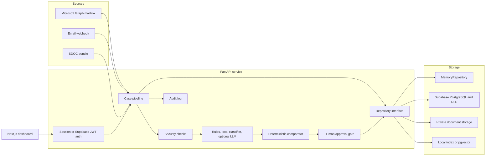

# NovaShip Averis

AI-assisted shipping inbox and deterministic Shipping Instruction (SI) to Draft Bill of Lading (BL) verification.

> AI reads, classifies, extracts, summarises, and drafts. Deterministic code decides the seven-field comparison. A person approves every outward action. Every state change is audited.

| Project status | Details |
| --- | --- |
| Web application | `http://localhost:3000` |
| API and Swagger UI | `http://localhost:8000/docs` |
| Default mode | Offline demo, in-memory repository, no API keys required |
| Demo data | 520 emails and 250 attachments |
| Verified test baseline | **66 backend tests passed**, frontend production build passed, Compose configuration valid (20 September 2026) |
| Recorded SDOC score | `1.0000`; reproducing the score requires the private organiser `ground_truth.json` |
| Demo password | `novaship123` for every seeded account |

## Table of contents

- [1. Overview](#1-overview)
- [2. What the platform does](#2-what-the-platform-does)
- [3. Verification contract](#3-verification-contract)
- [4. Architecture and data flow](#4-architecture-and-data-flow)
- [5. Technology stack](#5-technology-stack)
- [6. Quick start with Docker](#6-quick-start-with-docker)
- [7. Demo accounts and RBAC](#7-demo-accounts-and-rbac)
- [8. Development run modes](#8-development-run-modes)
- [9. Configuration reference](#9-configuration-reference)
- [10. Using the application](#10-using-the-application)
- [11. API reference](#11-api-reference)
- [12. Persistence and Supabase](#12-persistence-and-supabase)
- [13. AI, RAG, and LangGraph](#13-ai-rag-and-langgraph)
- [14. Security and safety model](#14-security-and-safety-model)
- [15. Tests, evaluation, and reproducibility](#15-tests-evaluation-and-reproducibility)
- [16. Deployment notes](#16-deployment-notes)
- [17. Troubleshooting](#17-troubleshooting)
- [18. Repository map](#18-repository-map)
- [19. Known limitations](#19-known-limitations)
- [20. Additional documentation](#20-additional-documentation)

## 1. Overview

Shipping documentation teams receive comparison requests, SI submissions, invoices, operational updates, automated notices, and spam in one shared mailbox. A single BL comparison can require an operator to locate two documents, reconcile different labels and formats, verify seven contractual fields, explain every discrepancy, draft a response, and preserve an audit trail.

NovaShip turns that inbox into a case-management workflow. It can:

1. ingest an email and its attachments;
2. perform deterministic security checks;
3. classify the message and decide whether action is required;
4. detect SI and Draft BL documents;
5. extract the seven required fields with evidence;
6. normalise only safe formatting differences;
7. compare SI and BL values using deterministic code;
8. recommend an action and create a draft;
9. pause for a human decision;
10. share or simulate notification after permission and confirmation checks;
11. record the full decision trail.

The repository contains two related orchestration paths:

- `Pipeline` is the main ingestion and case-processing path used by the dashboard and REST API.
- `CaseAgent` is the LangGraph state machine exposed by `/agent/*`; it supports pause/resume at the human-review node.

Both paths use the same contracts, repository abstraction, comparator, policies, permissions, and case services.

### Demo dataset

The bundled SDOC dataset contains 520 synthetic but realistic emails:

| Category | Count |
| --- | ---: |
| BL comparison | 220 |
| SI request | 125 |
| Invoice query | 75 |
| General | 60 |
| Spam | 40 |

There are 250 attachment files. They include TXT, PDF, DOCX, and XLSX SI/BL pairs, plus deliberate missing, wrong, blank, unreadable, and image-only cases. The data generator is deterministic and lives under `sdoc-hackathon-docker/data_v2/`.

The inbox has 124 messages with two attachments, two with one attachment, and 394 with none. Of the attachment-bearing verification requests, 109 can be decided cleanly, 46 contain one or more planted field defects, and 20 edge cases are designed to require escalation rather than a guessed verdict.

## 2. What the platform does

### Inbox and case operations

- Converts each unique email into an idempotent case.
- Shows status, priority, intent, category, confidence, assignment, document availability, security outcome, mismatch count, and open errors.
- Supports search, pagination, sorting, and filters for status, priority, intent, category, mismatch, assignee, recipient, sender, confidence, security outcome, and date.
- Provides batch drafting and review actions; batch operations never send external email.
- Exports cases as CSV and SDOC-compatible results as JSON.

### Document verification

- Reads `.txt`, text-layer `.pdf`, `.docx`, and `.xlsx` attachments.
- Detects SI, Draft BL, Invoice, Supporting Document, and Unknown Document.
- Extracts the required fields with the source document, page, line, literal snippet, and detected label.
- Preserves original values alongside normalised values.
- Routes missing, blank, unsupported, corrupt, scanned, or low-confidence data to review instead of guessing.
- Produces a field-by-field discrepancy report and an exact summary message.

### Human review and collaboration

- Generates confirmation, correction, missing-document, and information-response drafts.
- Allows a user to edit, approve, reject, reassign, retry, request review, mark no action, or complete a case.
- Separates the extracted Notify Party value from permission to contact a recipient.
- Requires an authorised recipient, a data preview, sufficient role permissions, and an extra confirmation for an external party.
- Records sent, viewed, acknowledged, response, and status metadata for a share.

### Oversight

- Provides a seven-field analytics page, security queue, AI-agent console, global audit page, policy editor, and in-app guide.
- Stores actor type (`USER`, `AI`, or `SYSTEM`), before/after state, evidence references, and policy version in audit events.
- Uses role-based access control (RBAC) for every protected API operation.
- Keeps policy changes versioned and audited.

## 3. Verification contract

The Shipping Instruction is always the source of truth. The comparator evaluates exactly these seven independent fields:

| Field | Safe normalisation | Deliberately not done |
| --- | --- | --- |
| Shipper | Case and whitespace | Legal-name rewriting |
| Consignee | Case, whitespace, conservative punctuation | Inferring a different legal entity |
| Notify Party | Case, whitespace, conservative punctuation | Treating the extracted value as permission to send |
| Port of Loading | Case, whitespace, separators, trailing UN/LOCODE removal | Port substitution without evidence |
| Port of Discharge | Case, whitespace, separators, trailing UN/LOCODE removal | Port substitution without evidence |
| Container Count | Parses values such as `3 x 40'HC` as `3` | Guessing from unclear text |
| Gross Weight (kg) | Parses commas/spaces and explicit metric-ton conversion | Silent imperial conversion or mixed alphanumeric values |

Each field receives one result:

- `MATCH`
- `MISMATCH`
- `MISSING_IN_SI`
- `MISSING_IN_BL`
- `LOW_CONFIDENCE_REVIEW`

The case-level result is `PASSED`, `ATTENTION_REQUIRED`, or `HUMAN_REVIEW`. If all seven fields match, the required message is exactly:

```text
No mismatch detected.
```

A missing or low-confidence value is not counted as a mismatch. It is routed to human review with one of four review reasons: `wrong_doc_type`, `missing_attachment`, `unreadable`, or `missing_value`.

## 4. Architecture and data flow



### Main pipeline

```text
Email
  -> security precheck
  -> intent classification
  -> attachment classification
  -> document extraction
  -> safe normalisation
  -> deterministic seven-field comparison
  -> policy evaluation and recommendation
  -> summary
  -> draft
  -> human approval
  -> notification/share
  -> audit
```

The security and intent stages can end the flow early. A security-review message is quarantined. Informational and spam messages are stored and summarised without document comparison. A verification request with missing documents becomes `WAITING_DOCUMENTS`; unreadable or uncertain content becomes `HUMAN_REVIEW`.

### Responsibility boundary

| Capability | Rules/local model | Optional LLM | Deterministic guard |
| --- | --- | --- | --- |
| Security precheck | Yes | Security explanation in the agent path | LLM can escalate, not clear a deterministic risk |
| Intent | Rules then TF-IDF/logistic regression | Final fallback for ambiguity | Confidence and override margins are recorded |
| Attachment type | Yes | No | Unreadable files are not guessed |
| Field extraction | Label and layout rules | Fallback for missing fields | LLM value must be supported by a literal document snippet |
| Comparison | Yes | **Never** | Pure seven-field comparator |
| Summary and draft | Templates | Wording polish | Required SI/BL values must remain present |
| Ask AI | Grounded intents and RAG | Free-form grounded answer | Refuses sending, bypassing policy, inventing values, or crossing case scope |
| Translation | Identifier masking | Translation | Names, ports, numbers, units, and references are restored |

## 5. Technology stack

| Layer | Technology |
| --- | --- |
| Frontend | Next.js 14.2, React 18.3, TypeScript 5.5, Tailwind CSS 3.4 |
| Backend | Python 3.11, FastAPI, Pydantic 2, Uvicorn |
| Local intent model | scikit-learn TF-IDF + logistic regression, persisted with joblib |
| Agent orchestration | LangGraph with memory or optional PostgreSQL checkpoints |
| LLM integration | OpenAI chat models through `LLM_PROVIDER=openai` |
| Embeddings | Local deterministic hashing, Gemini, or OpenAI |
| Vector storage | Local JSON index or Supabase pgvector |
| Document parsing | pypdf, python-docx, openpyxl; optional OCR hook |
| Persistence | In-memory fixtures or Supabase PostgreSQL, Storage, RLS, and JWT |
| Mail | SDOC bundle connector or Microsoft Graph inbound adapter |
| Containers | Docker multi-stage images and Docker Compose |
| Tests | pytest plus a production Next.js build |

## 6. Quick start with Docker

Docker is the recommended first run. It uses the checked-in demo snapshot and does not require Supabase, OpenAI, Gemini, or Microsoft credentials.

### Prerequisites

- Docker Desktop, or Docker Engine with the Compose plugin.
- Git.
- Ports `3000` and `8000` available, unless you override them.

### Start the application

From the repository root:

```bash
cp .env.example .env
docker compose up -d --build
docker compose ps
curl http://localhost:8000/health
```

PowerShell:

```powershell
Copy-Item .env.example .env
docker compose up -d --build
docker compose ps
Invoke-RestMethod http://localhost:8000/health
```

A healthy default response includes `"status": "ok"`, `"backend": "MemoryRepository"`, and `"cases": 520`.

Open:

- Application: `http://localhost:3000`
- Login: `http://localhost:3000/login`
- Swagger UI: `http://localhost:8000/docs`
- API health: `http://localhost:8000/health`

Sign in with `faraz_ali@aprilasia.com` and password `novaship123`, or use any account in [Demo accounts and RBAC](#7-demo-accounts-and-rbac).

### Stop the application

```bash
docker compose down
```

This stops the containers. It does not delete the source tree, built images, or external Supabase data. Do not add `-v` unless you explicitly intend to remove Compose volumes.

## 7. Demo accounts and RBAC

Every seeded account uses `DEMO_PASSWORD`, which defaults to `novaship123`.

| Role | Name | Email | Main access |
| --- | --- | --- | --- |
| Admin + Supervisor | Syed Faraz Ali | `faraz_ali@aprilasia.com` | All operations, policy editing, external approval, audit, export |
| Supervisor | Hari Mardianto | `hari_mardianto@aprilasia.com` | Approval, external notification, batch actions, audit, export |
| Supervisor | Teo Ei Leen | `eileen_teo@aprilasia.com` | Same supervisor access |
| Operations | Najiha Nur Hanna | `hanna_azhari@aprilasia.com` | Case work, comparison, drafts, assignment, internal sharing |
| Operations | Deswita Elvyani | `deswita_elvyani@aprilasia.com` | Same operations access |
| Operations | Willy Situmorang | `willy_ss@aprilasia.com` | Same operations access |
| Operations | Mitchelle Ting | `mitchelle_ting@aprilasia.com` | Same operations access |
| Auditor | Ooi Sok Yong | `sokyong_ooi@aprilasia.com` | Read-only cases, global audit, and export |

### Permission matrix

| Permission | Operations | Supervisor | Admin | Auditor |
| --- | :---: | :---: | :---: | :---: |
| View cases and documents | Yes | Yes | Yes | Yes |
| Compare and edit extraction | Yes | Yes | Yes | No |
| Generate/edit drafts | Yes | Yes | Yes | No |
| Approve an external draft | No | Yes | Yes | No |
| Share internally | Yes | Yes | Yes | No |
| Notify an external party | No | Yes | Yes | No |
| Assign a case | Yes | Yes | Yes | No |
| View policy | Yes | Yes | Yes | No |
| Edit policy | No | No | Yes | No |
| View global audit | No | Yes | Yes | Yes |
| Export data | No | Yes | Yes | Yes |
| Batch actions | No | Yes | Yes | No |
| Ingest email | Yes | Yes | Yes | No |

Self-registration at `/register` defaults to `OPERATIONS_STAFF`. `REGISTER_ALLOWED_ROLES` controls every role exposed by the form and accepted by the API. Keep `ADMIN` out of this allowlist; the current implementation trusts the configured allowlist.

Sessions are HMAC-signed and expire after 12 hours by default. Logout revokes the session server-side. Login, failed login, registration, and logout outcomes are audited.

## 8. Development run modes

Docker and host processes cannot bind the same port at the same time. Stop the active mode before switching.

### Docker live reload

```bash
docker compose -f docker-compose.yml -f docker-compose.dev.yml up -d --build
```

The development overlay bind-mounts `backend/app`, `backend/scripts`, `backend/models`, and the full `frontend` directory. Uvicorn and Next.js reload when host files change.

### Windows helper

The PowerShell helper manages containers and local Node/Python listeners:

```powershell
.\scripts\dev.ps1 docker
.\scripts\dev.ps1 docker-dev
.\scripts\dev.ps1 local
.\scripts\dev.ps1 frontend
.\scripts\dev.ps1 backend
.\scripts\dev.ps1 status
.\scripts\dev.ps1 stop
```

If execution is blocked:

```powershell
powershell -ExecutionPolicy Bypass -File .\scripts\dev.ps1 docker
```

`scripts/dev.sh` currently uses `netstat -ano`, `tasklist`, and `taskkill`; it is intended for Git Bash or similar Windows environments. On macOS and Linux, use the direct Docker and local commands in this README.

### Local backend and frontend

Prerequisites:

- Python 3.11+
- Node.js 20+
- npm

Terminal 1:

```bash
python3.11 -m venv ../novaship-venv
source ../novaship-venv/bin/activate
python -m pip install -r backend/requirements.txt
cd backend
python -m uvicorn app.main:app --reload --port 8000
```

Terminal 2:

```bash
cd frontend
npm ci
npm run dev
```

The backend loads the repository-root `.env` even when Uvicorn starts inside `backend/`. Relative bundle and seed paths are resolved against the repository root.

### Mixed modes

Local UI with Docker API:

```bash
docker compose stop web
docker compose up -d api
cd frontend
npm ci
npm run dev
```

Local API with Docker UI:

```bash
docker compose stop api
cd backend
python -m uvicorn app.main:app --reload --port 8000
```

Keep the unused Compose service stopped. The browser uses `NEXT_PUBLIC_API_BASE`, which defaults to `http://localhost:8000`.

## 9. Configuration reference

Copy `.env.example` to `.env`. Never commit `.env`. Variables with public frontend visibility must be safe for a browser; never put an API key or Supabase service-role key in `NEXT_PUBLIC_*`.

### Core and persistence

| Variable | Default | Description |
| --- | --- | --- |
| `REPO_BACKEND` | `memory` | `memory` or `supabase` |
| `TENANT_ID` | `tenant_april` | Tenant used for repository and vector scoping |
| `BUNDLE_DIR` | `./sdoc-hackathon-bundle` | Email fixture root |
| `SEED_SNAPSHOT` | `./supabase/seed/snapshot.json` | Snapshot loaded by `MemoryRepository` |
| `AUTO_SEED` | `1` | Load the snapshot at API startup |
| `SUPABASE_URL` | placeholder | Supabase project URL |
| `SUPABASE_ANON_KEY` | placeholder | Fallback key for Supabase access |
| `SUPABASE_SERVICE_ROLE_KEY` | placeholder | Server-only key used by the repository and seed push |
| `SUPABASE_JWT_SECRET` | placeholder | Verifies Supabase HS256 bearer tokens |
| `SUPABASE_STORAGE_BUCKET` | `documents` | Private attachment bucket |

### Authentication

| Variable | Default | Description |
| --- | --- | --- |
| `AUTH_MODE` | `demo` | `demo` accepts session tokens and `X-User-Id`; `jwt` disables header impersonation |
| `SESSION_SECRET` | insecure development fallback | HMAC secret for built-in session tokens; mandatory to replace in production |
| `SESSION_TTL_HOURS` | `12` | Session lifetime |
| `DEMO_PASSWORD` | `novaship123` | Password assigned to seeded users without a credential |
| `REGISTER_ALLOWED_ROLES` | `OPERATIONS_STAFF` | Comma-separated self-registration allowlist; never include `ADMIN` in a real deployment |

### Classification and LLM

| Variable | Default | Description |
| --- | --- | --- |
| `INTENT_MODEL_ENABLED` | `1` | Enable the local trained intent classifier |
| `INTENT_MODEL_PATH` | auto-detected `backend/models/intent_classifier.joblib` | Classifier artifact path |
| `LLM_PROVIDER` | `none` | `none` or `openai` |
| `OPENAI_API_KEY` | empty | Used only when OpenAI chat or embeddings are enabled |
| `LLM_MODEL` | `gpt-4o-mini` in code when unset | Optional chat-model override; `.env.example` suggests `gpt-4.1-mini` |

If the model artifact or API call fails, the application falls back to deterministic rules. The comparator never falls back to an LLM.

### RAG and agent checkpoints

| Variable | Default | Description |
| --- | --- | --- |
| `EMBEDDING_PROVIDER` | `local` | `local`, `gemini`, or `openai` |
| `GOOGLE_API_KEY` | empty | Gemini embedding key |
| `GEMINI_EMBEDDING_MODEL` | `models/text-embedding-004` | Gemini embedding model |
| `OPENAI_EMBEDDING_MODEL` | `text-embedding-3-small` | OpenAI embedding model |
| `VECTOR_STORE` | `local` | `local` JSON index or `supabase` pgvector |
| `RAG_DATA_DIR` | `backend/data` | Markdown knowledge and local index directory |
| `LANGGRAPH_CHECKPOINT` | `memory` | `memory` or `postgres` |
| `LANGGRAPH_PG_URL` | empty | PostgreSQL connection string for durable agent checkpoints |

The local, Gemini, and OpenAI embeddings use different dimensions. Rebuild the index after changing provider or model. The pgvector migration defaults to 768 dimensions and must be adjusted before using a provider with another dimension.

The optional PostgreSQL LangGraph checkpointer also requires `langgraph-checkpoint-postgres` and `psycopg[binary]`; these packages are not included in the default requirements file.

### Email, OCR, and networking

| Variable | Default | Description |
| --- | --- | --- |
| `EMAIL_PROVIDER` | `none` | `none`, `bundle`, or `graph` for inbound polling |
| `MS_TENANT_ID` | placeholder | Microsoft Entra tenant ID |
| `MS_CLIENT_ID` | placeholder | Microsoft Graph application/client ID |
| `MS_CLIENT_SECRET` | placeholder | Microsoft Graph client secret |
| `MS_MAILBOX` | placeholder | Shared mailbox user principal name |
| `EMAIL_SEND_MODE` | `simulate` in `.env.example` | Reserved setting; current case notifier records a simulated send and does not call Graph `sendMail` |
| `OCR_ENABLED` | `0` | Set to `1` to try the optional OCR hook for image-only PDFs |
| `CORS_ORIGINS` | local UI origins | Comma-separated API origins |
| `LOG_LEVEL` | `INFO` | Backend log level |
| `PORT` | `8000` | API container listen port used by the Docker image command |
| `NEXT_PUBLIC_API_BASE` | `http://localhost:8000` | API base embedded in the frontend production build |
| `WEB_PORT` | `3000` | Host port used by Compose for the frontend |
| `API_PORT` | `8000` | Host port used by Compose for the API |

OCR additionally requires `pytesseract`, `pdf2image`, Tesseract, and Poppler. They are not installed by the default Docker image or Python requirements.

## 10. Using the application

### Pages

| Route | Purpose |
| --- | --- |
| `/` | Inbox dashboard, metrics, filters, case table, and batch actions |
| `/cases/{id}` | Email, documents, comparison, evidence, drafts, actions, collaboration, errors, and timeline |
| `/verification` | Per-field match, mismatch, and review statistics |
| `/security` | Security-review, suspicious, spam, and anomaly queue |
| `/agent` | LangGraph diagram and run/state/resume controls |
| `/audit` | Global audit log for Supervisor, Admin, and Auditor |
| `/policies` | Effective policy for permitted roles; editing for Admin only |
| `/welcome` | Product guide |
| `/login` | Sign in and demo account picker |
| `/register` | Least-privilege self-registration |

### Recommended operator workflow

1. Sign in and open the Inbox.
2. Filter for `HUMAN_REVIEW`, mismatches, or high priority.
3. Open a case and review the source email and document status.
4. Inspect all seven field results and the literal evidence snippets.
5. If a document is missing or unreadable, upload a replacement and retry.
6. Review or edit the generated draft.
7. Approve, reject, assign, request review, or mark the case complete.
8. For Notify Party, select an authorised recipient and inspect the disclosure preview.
9. Confirm an external share if your role permits it.
10. Use the case timeline or Audit page to verify the recorded action.

### Case states

The API contract defines 18 states:

```text
RECEIVED
SECURITY_CHECK
SECURITY_REVIEW
CLASSIFIED
NO_ACTION_INFO
DOCUMENTS_DETECTED
WAITING_DOCUMENTS
EXTRACTING
COMPARING
NO_MISMATCH_DETECTED
MISMATCH_DETECTED
HUMAN_REVIEW
DRAFT_READY
NOTIFY_PARTY
AWAITING_RESPONSE
ASSIGNED
COMPLETED
ERROR
```

Not every case visits every state. The pipeline may finish early for spam, information-only mail, security review, missing documents, or extraction uncertainty.

## 11. API reference

Swagger UI at `/docs` is the source of truth for request and response schemas. The service currently exposes 56 routes.

### Authentication

Use one of these mechanisms:

1. Built-in session token: `Authorization: Bearer nsa.<token>`.
2. Supabase JWT: `Authorization: Bearer <jwt>` with `SUPABASE_JWT_SECRET` configured.
3. Demo-only header: `X-User-Id: u_admin_1` when `AUTH_MODE=demo`.

Unauthenticated routes are `/health`, `/auth/config`, `/auth/login`, `/auth/register`, and `/contracts/fields`. Other routes require a valid identity and, where applicable, a permission.

Login example:

```bash
curl -X POST http://localhost:8000/auth/login \
  -H 'Content-Type: application/json' \
  -d '{"email":"faraz_ali@aprilasia.com","password":"novaship123"}'
```

For quick demo calls:

```bash
curl 'http://localhost:8000/cases?mismatch=yes&limit=5' \
  -H 'X-User-Id: u_admin_1'
```

### Route catalogue

#### Health, identity, and contracts

| Method | Path | Purpose |
| --- | --- | --- |
| GET | `/health` | Repository type, case/email counts, timestamp |
| GET | `/me` | Current user and permissions |
| GET | `/users` | Users, teams, and approved parties |
| GET | `/contracts/fields` | Seven field names and exact no-mismatch message |

#### Authentication

| Method | Path | Purpose |
| --- | --- | --- |
| GET | `/auth/config` | Auth mode, registration roles, and demo account metadata |
| POST | `/auth/login` | Issue a session token |
| POST | `/auth/register` | Create a least-privilege account and session |
| POST | `/auth/logout` | Revoke the current session |
| GET | `/auth/session` | Validate the current session and return permissions |

#### Ingestion and connectors

| Method | Path | Purpose |
| --- | --- | --- |
| POST | `/webhooks/email` | Ingest an email with base64 attachments or fixture paths |
| POST | `/connectors/poll?limit=25` | Poll the configured bundle or Microsoft Graph connector |
| POST | `/ingest/bundle?limit=0` | Import the local SDOC fixture bundle |

The webhook is idempotent on message content. A duplicate returns the existing case instead of creating another one.

#### Dashboard and cases

| Method | Path | Purpose |
| --- | --- | --- |
| GET | `/dashboard/metrics` | Operational metrics grouped by status, intent, and priority |
| GET | `/dashboard/fields` | Aggregate results for each verification field |
| GET | `/dashboard/field/{field}` | Cases for one field and optional result filter |
| GET | `/cases` | Search, filter, sort, and paginate cases |
| GET | `/cases/{case_id}` | Complete case view with source email |
| GET | `/cases/{case_id}/comparison` | Seven-field comparison |
| GET | `/cases/{case_id}/report` | Compact and structured discrepancy report |
| GET | `/cases/{case_id}/audit` | Case audit events and shares |
| GET | `/cases/{case_id}/documents/{attachment_id}` | Attachment metadata and optional signed URL |
| GET | `/cases/{case_id}/documents/{attachment_id}/raw` | Raw attachment bytes with `nosniff` |

`GET /cases` supports `status`, `priority`, `intent`, `category`, `mismatch=yes|no`, `assigned`, `shared`, `sender`, `q`, `min_confidence`, `security`, `date_from`, `date_to`, `limit`, `offset`, and `sort`.

#### Pipeline and recovery

| Method | Path | Purpose |
| --- | --- | --- |
| POST | `/cases/{case_id}/classify` | Force case reprocessing from classification |
| POST | `/cases/{case_id}/extract` | Force reprocessing for extraction |
| POST | `/cases/{case_id}/compare` | Force reprocessing for comparison |
| POST | `/cases/{case_id}/retry` | Retry the case pipeline |
| POST | `/cases/{case_id}/upload` | Upload/re-link a missing SI or BL, then rerun |

The current service re-runs the complete pipeline for the classify/extract/compare/retry endpoints; the step name is recorded in the audit event.

#### Human decisions and collaboration

| Method | Path | Purpose |
| --- | --- | --- |
| POST | `/cases/{case_id}/draft` | Generate another draft, optionally translated |
| POST | `/cases/{case_id}/draft/edit` | Edit and version a draft |
| POST | `/cases/{case_id}/approve` | Approve a draft and record a simulated notification |
| POST | `/cases/{case_id}/reject` | Reject a draft and return the case to review |
| POST | `/cases/{case_id}/assign` | Assign a user or team |
| POST | `/cases/{case_id}/no-action` | Mark the case as no action required |
| POST | `/cases/{case_id}/complete` | Complete the case |
| POST | `/cases/{case_id}/request-review` | Send the case to human review |
| POST | `/cases/{case_id}/notify-party` | Begin the Notify Party flow |
| GET | `/cases/{case_id}/recipients` | List recipient choices and whether they are allowed |
| POST | `/cases/{case_id}/share` | Preview or create an internal/external share |
| POST | `/cases/{case_id}/share/{share_id}/confirm` | Confirm a pending external share |
| POST | `/shares/{share_id}/acknowledge` | Record view, acknowledgement, and response |
| POST | `/cases/batch` | Confirmed batch draft/review operations |

#### Ask AI, translation, export, and policy

| Method | Path | Purpose |
| --- | --- | --- |
| POST | `/cases/{case_id}/ask` | Grounded question about one case |
| POST | `/cases/{case_id}/translate` | Translate supplied text or the source email |
| GET | `/export/cases.csv` | Export cases as CSV |
| GET | `/export/submission.json` | Export SDOC submission JSON |
| GET | `/policies` | Active, effective, explained, and versioned policy |
| PUT | `/policies` | Update policy with an audit note; Admin only |

#### LangGraph, RAG, security, and global audit

| Method | Path | Purpose |
| --- | --- | --- |
| GET | `/agent/graph` | Mermaid graph and node list |
| POST | `/agent/run/{case_id}` | Run the agent until completion or interrupt |
| GET | `/agent/state/{case_id}` | Read checkpoint and interrupt state |
| POST | `/agent/resume/{case_id}` | Resume with a human decision |
| GET | `/rag/info` | Embedding provider, dimensions, store, and chunk count |
| POST | `/rag/search` | Search knowledge and optional case-scoped chunks |
| POST | `/rag/reindex` | Rebuild knowledge and case vectors; Admin only |
| GET | `/security/queue` | Security and anomaly cases |
| GET | `/audit` | Filtered global audit log |

## 12. Persistence and Supabase

### Memory mode

`REPO_BACKEND=memory` loads `supabase/seed/snapshot.json` at startup. This mode is fast, deterministic, and suitable for demos and tests. Changes, registered users, and revoked sessions are lost when the API process restarts.

### Supabase mode

Apply migrations in order:

1. `supabase/migrations/0001_schema.sql`: 24 operational tables, indexes, audit trigger, and private storage bucket.
2. `supabase/migrations/0002_rls.sql`: tenant-aware row-level security and role-gated policies.
3. `supabase/migrations/0003_vector.sql`: pgvector `case_embeddings` table and scoped similarity RPC.
4. `supabase/migrations/0004_accounts.sql`: `user_credentials` and `revoked_sessions`.

Then load `supabase/seed/seed.sql`, or push a generated seed:

```bash
cd backend
python -m app.seed.make_seed --push
```

The server-side repository uses `SUPABASE_SERVICE_ROLE_KEY` and enforces permissions in FastAPI. RLS is still configured to protect direct authenticated access. Attachments use a private `documents` bucket and five-minute signed URLs.

Regenerate the snapshot and SQL after changing the pipeline:

```bash
cd backend
python -m app.seed.make_seed
```

See [supabase/README.md](supabase/README.md) for schema verification queries and the full table list.

## 13. AI, RAG, and LangGraph

### Intent classifier

The intent cascade is:

```text
high-confidence rules -> local TF-IDF/logistic regression -> optional OpenAI fallback
```

The checked-in model uses a deterministic template-grouped split of 370 development emails and 150 untouched test emails. Its artifact and reports are:

- `backend/models/intent_classifier.joblib`
- `backend/models/intent_metrics.json`
- `backend/models/intent_split.json`

Retrain it without network calls:

```bash
cd backend
LLM_PROVIDER=none python scripts/train_intent_classifier.py
```

### RAG

Retrieval-augmented generation (RAG) indexes:

- policy, glossary, and port-alias Markdown files under `backend/data/`;
- source email text;
- case summary and comparison;
- extracted document text.

Case chunks carry `case_id`. Search for one case accepts global knowledge plus that case's chunks and rejects chunks from other cases.

Rebuild the index through the API:

```bash
curl -X POST http://localhost:8000/rag/reindex \
  -H 'Content-Type: application/json' \
  -H 'X-User-Id: u_admin_1' \
  -d '{}'

curl http://localhost:8000/rag/info \
  -H 'X-User-Id: u_admin_1'
```

### LangGraph human-in-the-loop flow

```text
security_precheck
  -> security_agent
  -> classify
  -> detect_documents
  -> extract
  -> compare
  -> summarize_and_draft
  -> human_review (interrupt)
  -> notify
```

The graph pauses only when a human decision is required. Resume actions include `approve`, `edit`, `reject`, `reassign`, `notify_party`, `retry`, `mark_no_action`, and `complete`. The resume path invokes the same permission-checked case services used by the standard UI.

## 14. Security and safety model

- Attachment content is parsed as data and never executed.
- Executable/script extensions are blocked, including `.exe`, `.bat`, `.cmd`, `.js`, `.vbs`, `.scr`, `.msi`, `.ps1`, `.jar`, `.com`, and `.dll`.
- Suspicious sender domains, links, spam phrases, attachment floods, duplicate messages, duplicate documents, and policy-bypass requests produce evidence-grounded signals.
- A critical attachment signal or policy-bypass request routes the case to `SECURITY_REVIEW`.
- Unknown, missing, blank, unreadable, or low-confidence values are not converted into a false mismatch.
- Every protected route resolves an authenticated user and checks a named permission.
- External recipients require a Supervisor or Admin, an approved party record, a preview, and human confirmation.
- Supabase rows are tenant-scoped and documents are private.
- Raw attachment responses include `X-Content-Type-Options: nosniff`.
- Ask AI is case-scoped and refuses actions that bypass the human approval path.

Production operators must replace `SESSION_SECRET`, use `AUTH_MODE=jwt` or another production identity layer, rotate provider secrets, restrict CORS, review trusted domains, and test restore/backup procedures.

## 15. Tests, evaluation, and reproducibility

### Current verification

The following checks were run on 20 September 2026:

| Check | Result |
| --- | --- |
| Backend tests in the API container | **66 passed in 1.60s** |
| Frontend `npm run build` | Passed, including TypeScript and Next.js page generation |
| `docker compose config --quiet` | Passed |
| Offline 520-email replay | Completed in 2.8s on the verification machine; timing is machine-dependent |

Backend coverage includes comparator and normalisation edge cases, extraction evidence, document readers, security, duplicate handling, end-to-end notification flow, RBAC, login/register/logout, policy permissions, batch confirmation, trained-classifier fallback, LangGraph interrupt/resume, RAG case scoping, field analytics, and security queue endpoints.

### Run backend tests locally

```bash
cd backend
PYTEST_DISABLE_PLUGIN_AUTOLOAD=1 python -m pytest -q
```

### Run backend tests with Docker

The API image does not contain the test directory, so mount the repository and set the working directory:

```bash
docker compose run --rm --no-deps \
  -v "${PWD}:/workspace" \
  -w /workspace/backend \
  -e LLM_PROVIDER=none \
  api pytest -q
```

PowerShell:

```powershell
docker compose run --rm --no-deps `
  -v "${PWD}:/workspace" `
  -w /workspace/backend `
  -e LLM_PROVIDER=none `
  api pytest -q
```

### Build the frontend

```bash
cd frontend
npm ci
npm run build
```

### Replay the SDOC bundle

```bash
cd backend
LLM_PROVIDER=none python scripts/run_bundle.py
```

Or with Docker:

```bash
docker compose run --rm --no-deps \
  -v "${PWD}:/workspace" \
  -w /workspace/backend \
  -e LLM_PROVIDER=none \
  api python scripts/run_bundle.py --out /workspace/submission.json
```

The runner always writes a submission. It prints the official score only when both `sdoc-hackathon-docker/data_v2/ground_truth.json` and `sdoc-hackathon-docker/server/scoring.py` are available. The ground-truth file is intentionally gitignored, so a normal clone prints `no ground truth available - submission written only`.

The project records a prior official result of `FINAL SCORE = 1.0000`, including stage-1 macro-F1 `1.000`, defect-F1 `1.000`, end-to-end `46/46`, and escalation F1 `1.000`. Treat those values as a recorded benchmark unless you have the private ground truth and rerun the scorer yourself.

Keep `LLM_PROVIDER=none` during regression scoring to make the run deterministic, offline, and free of provider cost.

## 16. Deployment notes

### Container deployment

- The API image is self-contained with application code, model artifact, knowledge files, fixture bundle, and seed snapshot.
- The web image uses Next.js standalone output.
- `NEXT_PUBLIC_API_BASE` is embedded at frontend build time. Rebuild `web` after changing it.
- The default Compose file starts only `api` and `web`; it does not start a local Supabase stack.
- The optional `scoring` profile also expects the organiser server and private ground truth to be present.

### Production checklist

- Set `REPO_BACKEND=supabase` and apply all migrations.
- Replace `SESSION_SECRET`; use `AUTH_MODE=jwt` to disable demo `X-User-Id` impersonation. Built-in signed sessions remain accepted.
- Set exact production `CORS_ORIGINS`.
- Store secrets in the deployment platform, not in the repository or frontend variables.
- Put the API behind TLS and a reverse proxy/load balancer.
- Use external object storage and database backups.
- Decide and test a durable LangGraph checkpoint store if paused graphs must survive restarts.
- Review pgvector dimensions before building a Supabase index.
- Keep `EMAIL_SEND_MODE` effectively simulated until a real outbound adapter is wired and acceptance-tested.
- Add observability, rate limiting, secret rotation, retention rules, and incident procedures before real production use.

## 17. Troubleshooting

### Port 3000 or 8000 is already in use

Stop the conflicting host process or Compose service. Do not run Docker web and local Next.js on the same port, or Docker API and local Uvicorn on the same port.

Override Compose host ports in `.env`:

```dotenv
WEB_PORT=3001
API_PORT=8001
NEXT_PUBLIC_API_BASE=http://localhost:8001
```

Rebuild the web image after changing `NEXT_PUBLIC_API_BASE`.

### Docker cannot find `.env`

```bash
cp .env.example .env
```

Compose declares the root `.env` as the API `env_file`, so a fresh clone needs this copy even when all defaults are acceptable.

### API reports zero cases

Check `/health`. In memory mode, confirm that `SEED_SNAPSHOT` points to `supabase/seed/snapshot.json` and `AUTO_SEED=1`. In Docker, recreate the API after checking the snapshot mount:

```bash
docker compose up -d --force-recreate api
```

### The UI still shows old code

Production images do not bind-mount source files:

```bash
docker compose build --no-cache web
docker compose up -d web
```

For active development, use the Compose live-reload overlay.

### `.env` changes have no effect

Environment variables are read when the API process starts:

```bash
docker compose up -d --force-recreate api
```

### The local classifier does not load

Install the pinned scikit-learn and joblib versions from `backend/requirements.txt`, verify `INTENT_MODEL_PATH`, or rebuild the API image. Runtime safely falls back to rules.

### RAG has chunks but returns no hits after a provider change

The vector dimensions no longer match. Rebuild the index. For Supabase, also update the vector column dimension and recreate/truncate the index as described in `0003_vector.sql`.

### Image-only PDF remains unreadable

Default images do not include OCR system packages. Either request a text-readable document or install Tesseract, Poppler, `pytesseract`, and `pdf2image`, then set `OCR_ENABLED=1`.

### An approved draft did not send real email

This is expected. The current notifier records `NOTIFICATION_SENT` with `mode: simulated`. Microsoft Graph supports inbound polling, and the connector class contains a send method, but the case service does not call it yet.

### `GET /` on port 8000 returns 404

This is expected. Use `/health` for health checks or `/docs` for Swagger UI.

## 18. Repository map

```text
NovaShip_Averis/
├── README.md                         Main project guide
├── AGENT.md                          AI, agent, RAG, and provider guide
├── P1.md ... P4.md                   Team workstream guides
├── .env.example                      Configuration template
├── docker-compose.yml                Baked demo stack
├── docker-compose.dev.yml            Live-reload overlay
├── scripts/
│   ├── dev.ps1                       Windows run-mode helper
│   └── dev.sh                        Git Bash/Windows shell helper
├── backend/
│   ├── app/main.py                   FastAPI entry point
│   ├── app/api/                      Auth, case, agent, RAG, audit routes
│   ├── app/contracts/schemas.py      Shared enums and data contracts
│   ├── app/pipeline/orchestrator.py  Main audited pipeline
│   ├── app/agents/                   LangGraph state, nodes, tools, RAG
│   ├── app/ai/                       Classifiers, extraction, drafts, assistant
│   ├── app/core/                     Normaliser, comparator, policy, recommendation
│   ├── app/readers/                  Safe attachment readers
│   ├── app/repositories/             Memory and Supabase implementations
│   ├── app/services/                 Case actions and submission conversion
│   ├── app/auth/                     Accounts, sessions, JWT, RBAC
│   ├── app/connectors/               Bundle and Microsoft Graph adapters
│   ├── app/seed/                      Snapshot and SQL seed generator
│   ├── data/                          RAG knowledge files and local index target
│   ├── models/                        Trained classifier and evaluation artifacts
│   ├── scripts/                       Bundle replay and model training
│   └── tests/                         66 collected backend tests
├── frontend/
│   ├── app/                           10 App Router pages
│   ├── components/                    Shell, comparison, policy, collaboration UI
│   ├── lib/api.ts                     Authenticated API client and mirrored types
│   └── public/                        Product assets
├── supabase/
│   ├── migrations/                    Schema, RLS, vector, and account migrations
│   └── seed/                          SQL, snapshot, and per-table JSON data
├── docs/                               Contracts, demo script, AI report, handoff notes
├── sdoc-hackathon-bundle/              520-email runtime fixture bundle
└── sdoc-hackathon-docker/              Dataset generator and optional scorer service
```

## 19. Known limitations

- Outbound notification is simulated. Real Microsoft Graph sending is not connected to the case-service approval path.
- The Gmail connector is a stub.
- OCR is optional and its packages are not included in the default environment.
- The default local RAG embedding is deterministic keyword-level hashing, not a semantic production embedding.
- Supabase pgvector migration is created at 768 dimensions and must be changed for local 256-dimensional or OpenAI 1536-dimensional vectors.
- PostgreSQL LangGraph checkpoint dependencies are optional and not in `backend/requirements.txt`.
- Memory mode loses runtime mutations on restart.
- The Bash run-mode helper is Windows-oriented; use direct commands on macOS/Linux.
- The private scorer ground truth is not included in Git.
- There is no repository `LICENSE` file. Do not assume redistribution or commercial-use rights until the maintainers add one.
- The project is a production-style prototype. It still needs real-provider integration testing, load testing, observability, rate limiting, operational backups, and a formal security review before production use.

## 20. Additional documentation

| Document | Purpose |
| --- | --- |
| [AGENT.md](AGENT.md) | AI components, LangGraph, RAG, keys, rebuilds, and test scenarios |
| [docs/CONTRACTS.md](docs/CONTRACTS.md) | Frozen fields, enums, API contracts, and submission shape |
| [docs/DEMO_SCRIPT.md](docs/DEMO_SCRIPT.md) | Five-minute demonstration flow |
| [docs/AI_REPORT_SECTION.md](docs/AI_REPORT_SECTION.md) | AI architecture and recorded evaluation |
| [docs/P4_EVIDENCE_HANDOFF.md](docs/P4_EVIDENCE_HANDOFF.md) | Frontend evidence semantics |
| [supabase/README.md](supabase/README.md) | Supabase schema, seed, verification, and auth model |
| [P1.md](P1.md) | AI extraction and verification workstream |
| [P2.md](P2.md) | Assistant and safety workstream |
| [P3.md](P3.md) | Backend, Supabase, and cloud workstream |
| [P4.md](P4.md) | Frontend and end-to-end workstream |

---

NovaShip's operating rule is simple: **AI proposes, deterministic code compares, humans approve, and the audit log remembers.**
