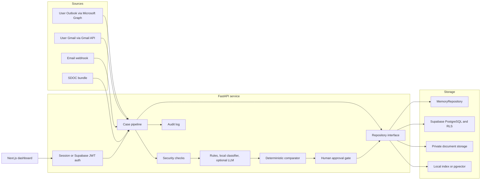
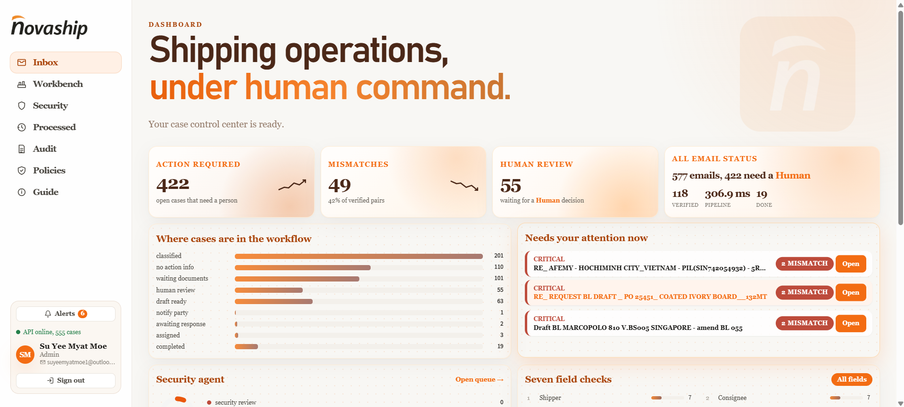
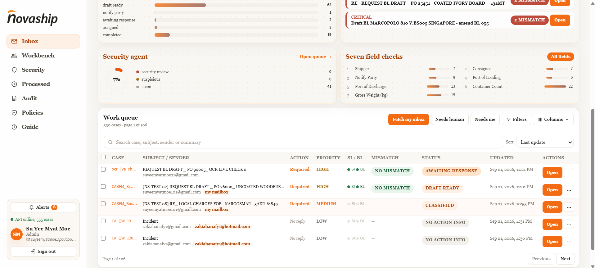
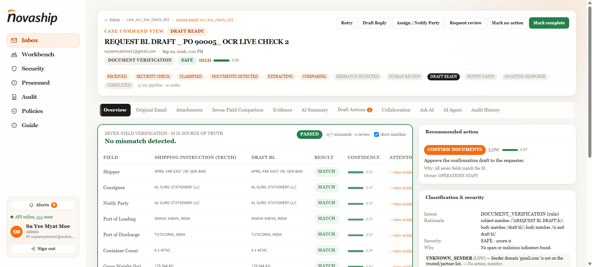
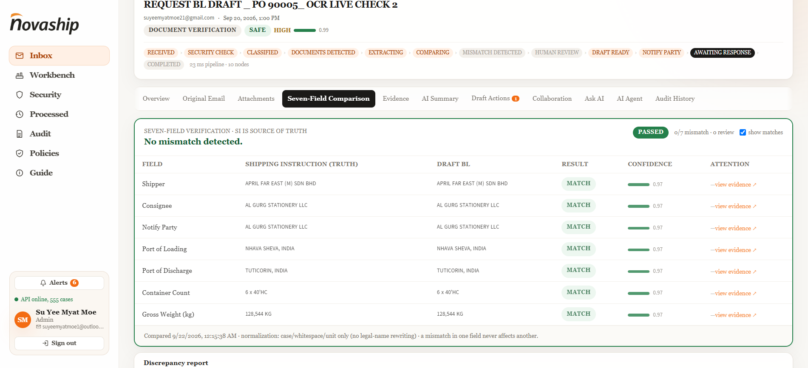
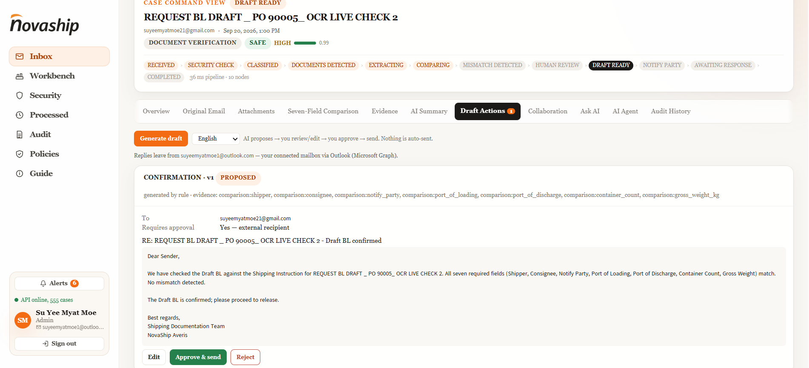
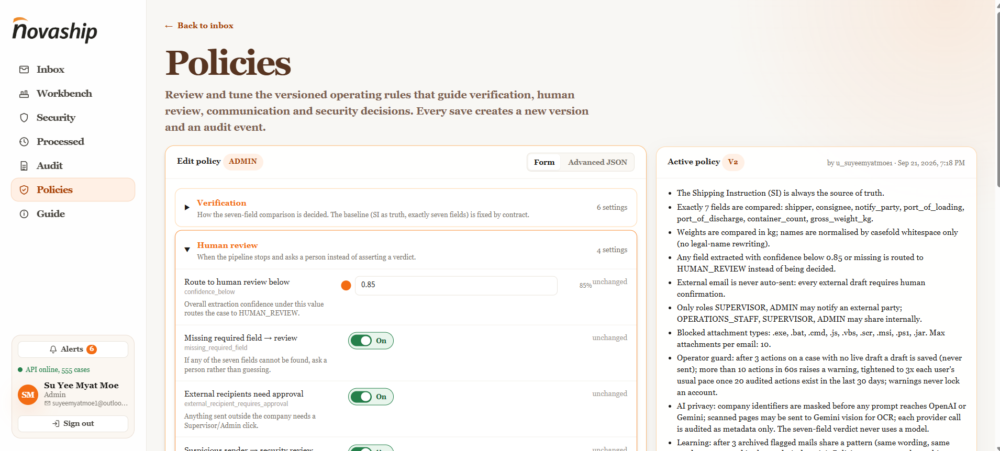
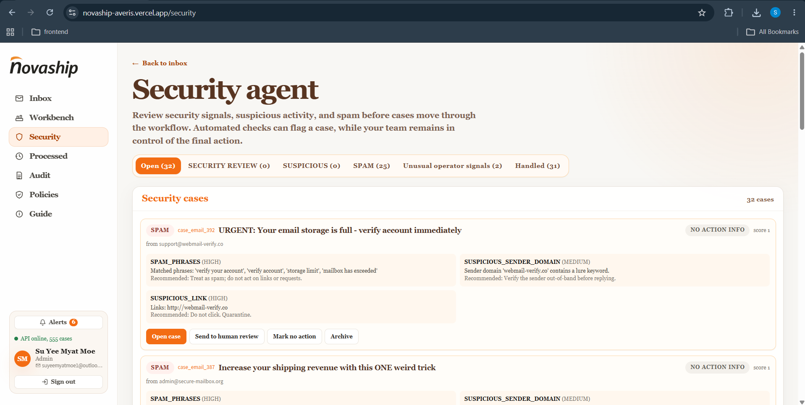

# NovaShip Averis

**Team Novabenders** — Averis × Monash Hackathon

Live: [https://novaship-averis.vercel.app](https://novaship-averis.vercel.app/)

AI-assisted shipping inbox and deterministic Shipping Instruction (SI) to Draft Bill of Lading (BL) verification.

AI reads, classifies, extracts, summarises, and drafts. Deterministic code decides the seven-field comparison. A person approves every outward action. Every state change is audited.

## Overview

Documentation teams receive SI/BL comparison requests mixed with invoices, notices, and spam. NovaShip turns that mailbox into a case:

1. Ingest the email and attachments.
2. Run security checks.
3. Classify intent and detect SI / Draft BL.
4. Extract and compare seven contractual fields.
5. Recommend an action and generate a draft.
6. Pause for a human decision.
7. Record the trail in audit.

Nothing is auto-sent.

## Verification

The Shipping Instruction is always the source of truth. The comparator evaluates exactly these seven independent fields:

| Field | Safe normalisation |
| --- | --- |
| Shipper | Case and whitespace |
| Consignee | Case, whitespace, conservative punctuation |
| Notify Party | Case, whitespace, conservative punctuation |
| Port of Loading | Case, whitespace, separators, trailing UN/LOCODE |
| Port of Discharge | Case, whitespace, separators, trailing UN/LOCODE |
| Container Count | Parses values such as `3 x 40'HC` as `3` |
| Gross Weight (kg) | Commas/spaces and explicit metric-ton conversion |

Each field is `MATCH`, `MISMATCH`, `MISSING_IN_SI`, `MISSING_IN_BL`, or `LOW_CONFIDENCE_REVIEW`. The case is `PASSED`, `ATTENTION_REQUIRED`, or `HUMAN_REVIEW`. Missing or low-confidence values are not counted as mismatches; they go to review. If all seven match, the required message is exactly: `No mismatch detected.`

## Architecture

```text
email → security → classify → extract → compare → draft → human → audit
```



The LLM never decides MATCH vs MISMATCH. Security and intent can end the flow early (quarantine, spam, informational). Incomplete documents stay open as `WAITING_DOCUMENTS` or `HUMAN_REVIEW` so staff can upload and retry.

## Features and Impact

- **Security in the operator's hands.** Flagged mail sits on Security until a person archives it or moves it to human review so the case can proceed.
- **Self-learning.** Operator-guard and policy suggestions learn from audit activity to reduce repeat mistakes without locking accounts or auto-changing rules.
- **LLM data mask.** Company identifiers are masked before prompts so OpenAI/Gemini never see raw counterparts.
- **Workbench.** Manual, parallel, and evaluation runs for a case (or a batch) without waiting on inbox poll.
- **Batch parallel run.** Several cases process at once to cut desk time.
- **Multi-file attachments.** SI, Draft BL, and supporting files on one case.
- **Multi-language email.** Drafts and replies can be generated or translated for the recipient.
- **Human-in-the-loop drafts.** AI proposes → you review/edit → you approve → send.

### Inbox

Live work queue: cases that still need a person. Dashboard KPIs, workflow counts, and **Needs human** / **Needs me** filters.





### Case command view

One case: status ribbon, seven-field result, recommended action, and tabs for evidence, drafts, and audit.



### Seven-field comparison

SI vs Draft BL, field by field, with evidence. SI is the source of truth.



### Draft Actions

Confirmation or correction draft. **Approve & send** only after a human click. Nothing is auto-sent.



### Policies

Versioned rules for the AI pipeline: verification, human-review gates, and communication. Saves create a new version and an audit event.



### Security

Spam and suspicious senders. Archive, or send to human review to proceed. The queue stays under user control.



## Pages

| Page | Purpose |
| --- | --- |
| **Inbox** | Live queue. Open work, not a history dump. |
| **Processed** | Destination for finished runs: processed actions, human-review outcomes, and failed process in one place. |
| **Audit** | Permissioned log of `USER`, `AI`, and `SYSTEM` events. |
| **Policies** | User-edited rules that steer the pipeline. |
| **Security** | Flagged mail; archive or escalate to human review. |
| **Workbench** | Manual, parallel batch, and evaluation runs. |
| **Case** | Overview, seven-field comparison, Draft Actions. |

## Technology stack

| Layer | Technology |
| --- | --- |
| Frontend | Next.js, React, TypeScript, Tailwind CSS |
| Backend | Python, FastAPI |
| AI | OpenAI chat; Gemini embeddings (vision OCR when keyed); local classifier fallback |
| Data | Supabase (PostgreSQL, RLS, Storage, pgvector) |
| Cloud / deploy | Vercel Services — Next.js plus FastAPI under `/api` |
| Local run | Docker Compose |

## Implementation

- One Vercel project: the browser talks same-origin `/api`; local Docker uses `http://localhost:8000`.
- Cases, users, and encrypted mailbox tokens persist in Supabase. Memory mode is demo-only and resets on restart.
- Seven-field comparison is deterministic code. The LLM may polish wording; it cannot change a MATCH/MISMATCH.
- Drafts and external shares require a human click. `EMAIL_SEND_MODE=simulate` records approval only; `live` sends from the connected mailbox.
- LangGraph can pause at human review and resume on the Workbench / case **AI Agent** tab.
- After `.env` edits, recreate the API container (`docker compose up -d --force-recreate api`). After Vercel env changes, redeploy.

## Run with Docker

```bash
cp .env.example .env
docker compose up -d --build
```

- UI: http://localhost:3000
- API health: http://localhost:8000/health
- Login: `faraz_ali@aprilasia.com` / `novaship123`
- Stop: `docker compose down`

## Challenges

- Outward mail must stay human-gated; simulate vs live is easy to leave stale (Compose and Vercel bake env at create/deploy time, not on a plain restart).
- The LLM must not own the verification verdict, or SI-as-truth is lost.
- Vercel serverless has no durable background poll; inbox fetch is on demand.
- Hobby Python unzipped size is tight; the API bundle has to stay under the platform cap.
- Personal Outlook sending to Gmail is often filtered until the recipient marks it not spam.

## Future roadmap

- Customer-facing actions (provide a document, confirm a value) without exposing the ops dashboard.
- Append-only re-check when a new SI or BL arrives; never overwrite earlier evidence.
- Shipment milestones after BL confirmation (finalize → process → complete).
- Stronger OCR packaging and self-evaluation without a private scorer file.
- Production observability, rate limits, and backups before treating the desk as a live operations system.
